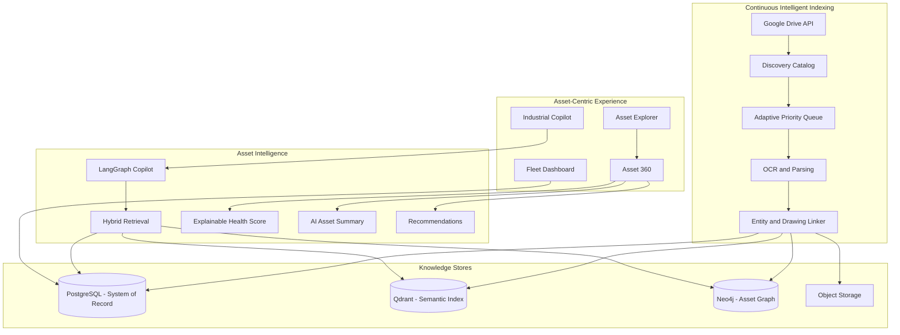

# Industrial-Knowledge_Intelligence_Platform
An AI-powered Industrial Knowledge Intelligence Platform that unifies engineering documents, maintenance records, safety procedures, regulations, drawings, and technical knowledge into a searchable, asset-centric system using RAG, Knowledge Graphs, and intelligent copilots for industrial operations.

# Industrial Brain AI

**AI-powered Industrial Knowledge Intelligence Platform**

> *Explore assets. Receive intelligence. Make decisions.*  
> Assets are the application. Documents are evidence. Knowledge is the product. AI is the interface.

[](#milestone-progress)
[](docs/ARCHITECTURE.md)
[](#license)

---

## Project Overview

**Industrial Brain AI** is an asset-agnostic Industrial Digital Brain for manufacturing and heavy industry. Engineers open an **asset** (motor, pump, valve, and more), see linked engineering knowledge in one place, and ask an Industrial Copilot for cited answers — without hunting through thousands of PDF folders.

Hackathon Version 1 focuses on a complete **Motor Asset 360** digital twin over a real multi-domain corpus (~27,300 engineering documents), while the data model and APIs stay ready for every other asset type without redesign.

| We are building | We are not building |
|---|---|
| Industrial knowledge intelligence | Chat-with-PDF demo |
| Asset-first operational UX | Document management system |
| Explainable scores + cited AI | Black-box “ML prediction” theater |
| Production-bound modular monolith | Throwaway prototype |

**Primary workflow:** Asset → Knowledge → AI → Decision

---

## Problem Statement

Industrial teams manage tens of thousands of drawings, datasheets, performance tests, manuals, safety procedures, regulations, and certifications. Finding the right evidence for one asset can take hours. Knowledge is fragmented across folders, formats, and systems.

Industrial Brain AI collapses that fragmentation into a single asset-centered experience with continuous indexing, a knowledge graph spine (drawing-number cross-references), and explainable intelligence.

---

## Features

| Capability | What users get |
|---|---|
| **Continuous Intelligent Indexing** | Live discovery & adaptive priority indexing across the corpus |
| **Asset Explorer** | Browse/search assets (motors first) — not raw folders |
| **Asset 360 (flagship)** | Specs, docs, timeline, AI summary, health, recommendations, mini-graph |
| **Explainable Health Score** | Deterministic 0–100 score with evidence bullets (Python-owned, not LLM-owned) |
| **AI Recommendations** | Proactive action cards with citations |
| **Drawing Explorer** | Cross-reference by drawing numbers (e.g. `3GZF…`, `9AKK…`) |
| **Knowledge Graph** | Asset-centered relationships (Neo4j) |
| **Industrial Copilot** | Motor-scoped Q&A with citations and confidence |
| **Maintenance & Compliance** | Test trends / anomaly RCA framing; regulation ↔ evidence gaps |
| **Fleet Dashboard** | Corpus scale, indexing progress, risk highlights |

---

## Architecture Diagram



**Persistence rule:** PostgreSQL is the system of record. Neo4j and Qdrant are derived indexes.

Full design: [docs/ARCHITECTURE.md](docs/ARCHITECTURE.md)

---

## Tech Stack

| Layer | Choice |
|---|---|
| Backend | FastAPI (Python) + Celery + Redis |
| Frontend | Next.js (App Router) + TypeScript + Tailwind + shadcn/ui |
| Relational DB | PostgreSQL |
| Graph DB | Neo4j |
| Vector DB | Qdrant |
| Agents | LangGraph |
| Parsing (demo) | Azure AI Document Intelligence + PyMuPDF / pdfplumber |
| Embeddings (demo) | OpenAI `text-embedding-3-small` (or Voyage) |
| LLMs | GPT-4o / Claude + fast router model |
| Auth | JWT seed users or Clerk/Auth0 (hackathon) |
| Deploy | Docker Compose locally; hybrid cloud demo path |
| Data ingress | Google Drive API |

---

## Dataset Overview

Multi-domain industrial corpus on **Google Drive** (~**27,300** documents).

| Domain | Approx. docs | Role |
|---|---|---|
| **Motors (ABB Low Voltage)** | **20,134** | Hero demo — deepest Asset 360 |
| Pumps / Valves / Compressors / … | Remaining ~7K | Catalog + asset-agnostic path |

**Motors folder value (examples):** performance test reports (IEC 60034), product datasheets, manuals, maintenance, safety, regulations, sensors, SOPs, drawings (metadata-first at scale).

**Indexing narrative:** discover the full corpus early; deep-index with **Adaptive Prioritization** (tests → datasheets → manuals → …). Externally this is **Continuous Intelligent Indexing** — the platform is always learning.

---

## Project Structure

```
.
├── docs/
│   ├── ARCHITECTURE.md              # Design authority
│   ├── IMPLEMENTATION_PLAN.md       # Execution & progress
│   └── MILESTONE_GIT_WORKFLOW.md    # Git / release protocol
├── backend/                         # FastAPI modular monolith
├── frontend/                        # Next.js enterprise shell
├── docker/                          # Dockerfiles + corpus placeholder
├── docker-compose.yml               # Local full stack (Milestone 1.9)
├── scripts/                         # Ops helpers (Phase 1 validation gate)
├── .gitignore
└── README.md
```

Target backend modules (Architecture): `gdrive`, `indexing`, `motors`, `extraction`, `knowledge`, `graph`, `motor360`, `timeline`, `summary`, `health`, `recommendations`, `agents`, `reasoning`, `citations`, `auth`, `api`, `observability`.

---

## Milestone Progress

Development is **milestone-based** (not day-based). One milestone = one feature branch = one release-quality commit. See [docs/MILESTONE_GIT_WORKFLOW.md](docs/MILESTONE_GIT_WORKFLOW.md).

**Legend:** Done · In progress · Planned

### Governance (complete)

| Item | Aspect delivered |
|---|---|
| Architecture Report | Product, modules, RAG, graph, UX, security, phases locked |
| Implementation Plan | Phases, milestones, tasks, DoD, validation, trackers |
| Milestone Git Workflow | Branch / commit / tag / PR / stop protocol |
| Repository bootstrap | Project-local git + `.gitignore` + stable `main` docs baseline |

### Phase 1 — Foundation

| Milestone | Aspect | Status |
|---|---|---|
| **1.1** Project Bootstrap | Monorepo layout, backend/frontend scaffolds, tooling baselines | Complete |
| **1.2** Backend Foundation | FastAPI app, settings, DI, middleware, errors, OpenAPI, health | Complete |
| **1.3** Database | PostgreSQL + Alembic; asset/document/job schemas | Complete |
| **1.4** Authentication | Login / refresh / me; seeded RBAC roles | Complete |
| **1.5** Object Storage | Blob/MinIO abstraction; upload/download | Complete |
| **1.6** Google Drive Integration | Discovery, checkpoints, selective download | Complete |
| **1.7** Document Catalog & Upload | Catalog upsert; path classification; upload API | Complete |
| **1.8** Frontend Shell | Next.js nav shell; enterprise sidebar routes | Complete |
| **1.9** Docker Compose Stack | API, web, Postgres, Redis, Neo4j, Qdrant, storage | Complete |
| **1.10** Logging Foundation | Structured JSON logs + correlation IDs | Complete |
| **1.11** Foundation Validation Gate | Phase 1 DoD + checklist sign-off | Complete |

### Phase 2 — Document Intelligence

| Milestone | Aspect | Status |
|---|---|---|
| **2.1** Parsing & OCR | Tiered parsers (PyMuPDF, Azure DI, metadata-only CAD) | Complete |
| **2.2** Entity Extraction | Drawing numbers, specs, IEC 60034 measurements | Complete |
| **2.3** Chunking | Doc-type-aware chunks + citation metadata | Complete |
| **2.4** Embeddings | Versioned embedding pipeline | Complete |
| **2.5** Qdrant Indexing | Vector upsert + payload filters | Complete |
| **2.6** Neo4j Graph Sync | Asset-center graph + drawing-number hubs | Complete |
| **2.7** Hybrid Retrieval | Vector + metadata + graph + rerank | Complete |
| **2.8** Citations | Provenance formatter + verifier | Complete |
| **2.9** Indexing Workers | Adaptive priority queue + status APIs | Complete |
| **2.10** Validation Gate | Hero-motor evidence chain proven | Complete |

### Phase 3 — Asset Intelligence

| Milestone | Aspect | Status |
|---|---|---|
| **3.1** Asset Registry | Asset-agnostic model + motor hierarchy | Complete |
| **3.2** Asset Explorer | Browse/filter/search assets | Complete |
| **3.3** Asset 360 API | Single-bundle motor/asset intelligence API | Complete |
| **3.4** Timeline | Lifecycle events from evidence | Complete |
| **3.5** AI Summary | Cached executive brief with citations | Complete |
| **3.6** Health Score | Deterministic explainable risk score | Complete |
| **3.7** Recommendations | Citation-backed action cards | Complete |
| **3.8** Drawing Explorer | Drawing-number cross-reference UI/API | Complete |
| **3.9** Knowledge Graph UI | Motor-centered visualization | Complete |
| **3.10** Unified Search | Asset + knowledge + drawing search | Complete |
| **3.11** Fleet Dashboard | Scale KPIs + indexing progress | Complete |
| **3.12** Asset 360 Frontend | Flagship demo screen | Complete |
| **3.13** Validation Gate | Hero Motor 360 end-to-end | Complete |

### Phase 4 — Industrial AI

| Milestone | Aspect | Status |
|---|---|---|
| **4.1** Query Router | Intent + entity linking | Complete |
| **4.2** Industrial Copilot | LangGraph agent + SSE chat + citations | Complete |
| **4.3** Maintenance Intelligence | Test trends / patterns | Complete |
| **4.4** RCA Assistant | Test-anomaly / evidence-gap reasoning | Complete |
| **4.5** Compliance Center | Requirement ↔ evidence gaps | Complete |
| **4.6** Analytics | Coverage & indexing velocity | Complete |
| **4.7** Reasoning Hardening | Multi-hop + numeric claim checks | Complete |
| **4.8** Validation Gate | Demo Copilot questions pass | Complete |

### Phase 5 — Enterprise

| Milestone | Aspect | Status |
|---|---|---|
| **5.1–5.6** | RBAC, audit, caching, workers, monitoring, security | Planned |
| **5.7** | Enterprise validation gate | Planned |

### Phase 6 — Testing & Polish

| Milestone | Aspect | Status |
|---|---|---|
| **6.1–6.4** | Tests, golden eval, e2e gates, UX polish | Planned |
| **6.5–6.6** | Deployment, demo video & presentation | Planned |
| **6.7–6.8** | Docs sync + final release gate | Planned |

Detailed tasks and definitions of done: [docs/IMPLEMENTATION_PLAN.md](docs/IMPLEMENTATION_PLAN.md)

---

## Installation & Setup

```bash
git clone <your-repo-url>
cd "INDUSTIAL INTELLIGENCE PARTNER"
```

**Prerequisites:** Docker Desktop (Compose v2), and optionally Python 3.11+ / Node.js 20+ for non-Compose local work.

### One-command local boot (Milestone 1.9)

```bash
cp .env.example .env
docker compose up --build
```

First build compiles the Next.js production image and may take several minutes. Subsequent starts reuse cached layers and named volumes.

| Service | URL / port |
|---|---|
| Frontend | http://localhost:3000 |
| API | http://localhost:8000 |
| OpenAPI | http://localhost:8000/docs |
| Health | `GET http://localhost:8000/health` |
| Ready | `GET http://localhost:8000/ready` |
| MinIO API / Console | http://localhost:9000 · http://localhost:9001 |
| Neo4j Browser | http://localhost:7474 |
| Qdrant | http://localhost:6333 |
| Postgres | `localhost:5432` |
| Redis | `localhost:6379` |

**Seeded login (after API starts):** `admin@example.com` / `ChangeMeAdmin!`

**Optional corpus mount:** set `CORPUS_HOST_PATH` in `.env` to your dataset folder on the host. It is bind-mounted read-only at `/corpus` inside the API container (`CORPUS_LOCAL_ROOT=/corpus`).

**Stop / reset:**

```bash
docker compose down          # keep volumes
docker compose down -v       # wipe Postgres / MinIO / Neo4j / Qdrant / Redis data
```

**Phase 1 validation gate (Milestone 1.11):** with the stack up:

```bash
python scripts/validate_phase1.py
```

---

## Running the Project

| Mode | Command |
|---|---|
| Full stack (recommended) | `docker compose up --build` |
| API only (host Python) | See `backend/README.md` |
| Frontend only (host Node) | See `frontend/README.md` |

---

## Demo Workflow

Judge-facing path (Architecture demo narrative):

1. **Fleet Dashboard** — corpus scale + Continuous Intelligent Indexing progress  
2. **Asset Explorer** — filter motors; open the **hero motor**  
3. **Asset 360** — specs, AI summary, explainable health, recommendations, linked docs  
4. **Timeline** — lifecycle evidence in order  
5. **Knowledge Graph** — asset at the center  
6. **Industrial Copilot** — cited answers (efficiency/tests, LOTO, certifications)  
7. **Maintenance / Compliance** — brief evidence views  

Product UI avoids jargon like “RAG” or “embeddings” on screen labels.

---

## API Overview

Versioned REST under `/api/v1/` with envelope `{ data, meta, errors }`.

| Group | Purpose |
|---|---|
| Auth | login, refresh, me, permissions |
| Motors / Assets | list, search, serial lookup, related |
| Asset 360 | full intelligence bundle |
| Timeline / Summary / Health / Recommendations | asset intelligence services |
| Google Drive Sync / Indexing | discovery & continuous indexing status |
| Documents | secondary library access |
| Drawings | drawing-number cross-reference |
| Search / Graph | unified search + subgraph |
| Copilot | streaming chat + feedback |
| Maintenance / RCA / Compliance / Analytics / Dashboard | operational intelligence |
| Admin | users, roles, audit export |

OpenAPI is generated from FastAPI once Milestone 1.2+ is complete.

---

## Screenshots

_Coming later — Asset 360, Fleet Dashboard, Copilot, and Graph views will be added here as UI milestones complete._

| Screen | Status |
|---|---|
| Fleet Dashboard | Complete (Phase 3.11) |
| Asset Explorer | Complete (Phase 3.2) |
| Asset 360 | Complete (Phase 3.12) |
| Industrial Copilot | Complete (Phase 4.2) |
| Knowledge Graph | Complete (Phase 3.9) |
| Maintenance Intelligence | Complete (Phase 4.3) |
| Compliance Center | Complete (Phase 4.5) |
| Analytics | Complete (Phase 4.6) |

---

## Future Enhancements

- Deep Asset 360 for non-motor domains (pumps, valves, compressors, …)  
- On-prem path: Docling + PaddleOCR, `bge-m3`, vLLM / Llama  
- Enterprise IdP (OIDC/SAML), full ACL-aware retrieval  
- Customer connectors (SharePoint, NAS, blob) beyond Google Drive  
- Distributed vector/graph scale for multi-plant fleets  
- Expanded golden evaluation (100+ industrial questions)

---

## Team

| Role | Name |
|---|---|
| Lead / Architect | _TBD_ |
| Backend / AI | _TBD_ |
| Frontend / UX | _TBD_ |
| Data / Domain | _TBD_ |

Update this table with your hackathon roster.

---

## License

MIT License — see `LICENSE` (to be added) or use freely for hackathon evaluation with attribution to the Industrial Brain AI team.

---

## Documentation

| Document | Purpose |
|---|---|
| [docs/ARCHITECTURE.md](docs/ARCHITECTURE.md) | Design source of truth |
| [docs/IMPLEMENTATION_PLAN.md](docs/IMPLEMENTATION_PLAN.md) | Milestones, tasks, DoD, trackers |
| [docs/MILESTONE_GIT_WORKFLOW.md](docs/MILESTONE_GIT_WORKFLOW.md) | Git branch / tag / PR protocol |

**Current engineering focus:** Milestone **5.1 — RBAC Hardening** (next implementation step; awaiting approval). Phase 4 Industrial AI is **Complete**.
