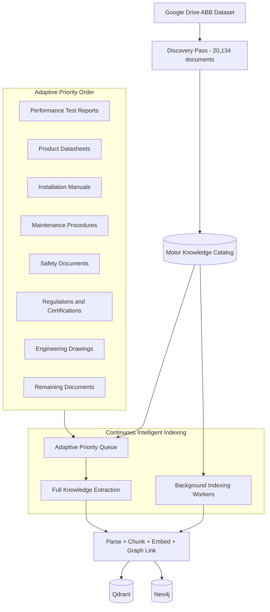
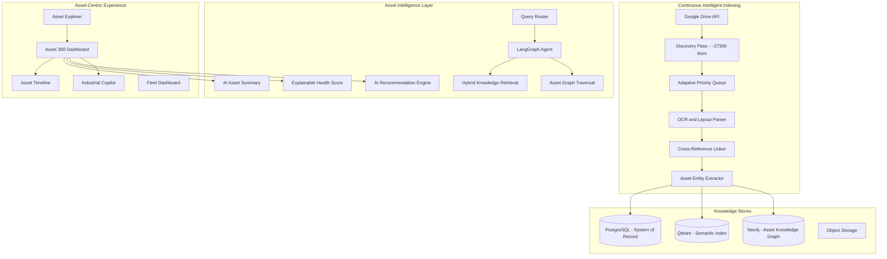
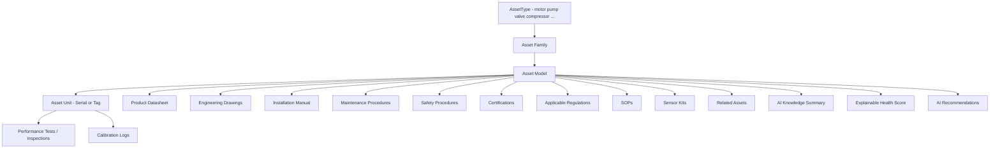
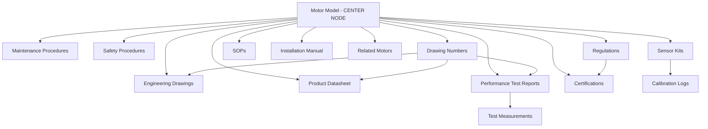
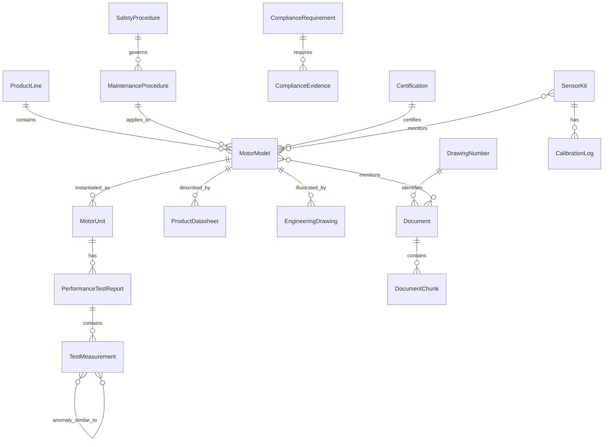
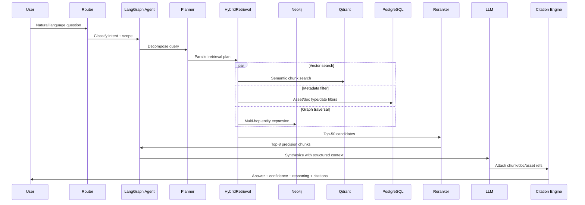
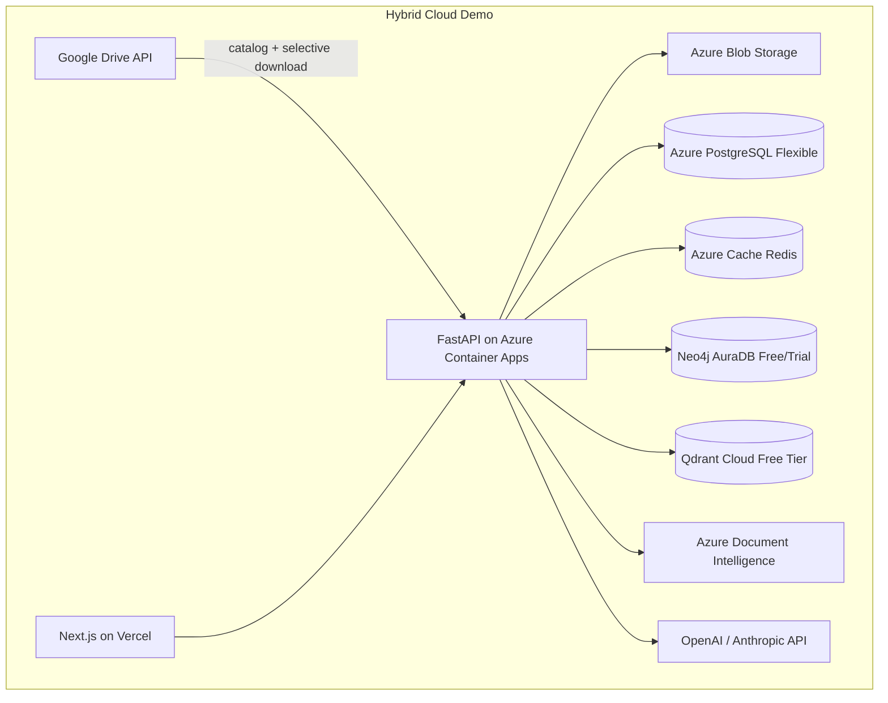

# Industrial Brain AI — Master Software Architecture Report

**Document Type:** Software Architecture Document (SAD) / Technical Design Document (TDD) / Product Requirements Document (PRD) / Engineering Blueprint  
**Status:** OFFICIAL — Source of Truth  
**Created:** 2026-07-16  
**Last Updated:** 2026-07-16  

> Companion execution guide: [IMPLEMENTATION_PLAN.md](IMPLEMENTATION_PLAN.md). Architecture Report wins on any conflict.


**Product Name:** **Industrial Brain AI**  
**Positioning:** *AI-powered Industrial Knowledge Intelligence Platform that transforms disconnected engineering knowledge into a continuously evolving operational intelligence system.*  
**Taglines:** "Industrial Digital Brain" | "Explore assets. Receive intelligence. Make decisions."  
**Internal / former names:** MotorMind AI, FactoryMind AI (repo naming may retain these)  
**Classification:** Asset-Agnostic Industrial Knowledge Intelligence Platform  
**Timeline:** 3 days (Jul 16–19, 2026) — final evaluation round; hackathon = **Version 1** of a production product  
**Deployment:** Hybrid — cloud demo for judges; on-prem production path required  
**Workspace Status:** Greenfield (no existing code in [`c:\Users\gauth\INDUSTIAL INTELLIGENCE PARTNER`](c:\Users\gauth\INDUSTIAL INTELLIGENCE PARTNER))  
**Data Source:** Multi-domain industrial corpus on **Google Drive** — **≈27,300 documents** (Motors richest; architecture asset-agnostic)

### Product Philosophy (Immutable)

| Concept | Role |
|---|---|
| **Assets** | Center of the application — context |
| **Documents** | Evidence only — never the primary UX |
| **Knowledge** | The product — relationships + intelligence |
| **AI** | The interface — reasoning, not ownership of business rules |

**Primary user workflow:** Asset → Knowledge → AI → Decision

### What We Are NOT Building

Technologies we use (search, vectors, graphs, chat) are **components**, not the product:

- Not Chat with PDF / document search / AI chatbot demo
- Not RAG / Vector Search / Knowledge Graph demos
- Not a Document Management System
- Not SCADA or CMMS replacement

### What We ARE Building

An **Industrial Brain** that behaves like a senior industrial engineer: users explore industrial assets and receive explainable operational intelligence across engineering, maintenance, quality, compliance, operations, safety, drawings, manuals, test reports, SOPs, regulations, certifications, sensors, and historical documentation.

**Hackathon demo focus:** Motors (richest documentation).  
**Architecture mandate:** Asset-agnostic — pumps, valves, compressors, boilers, turbines, pipelines, chemical plants, oil refineries must work **without redesign**.

---

## 1A. Dataset Reality — Multi-Domain Industrial Corpus

### Corpus Inventory (Approximate)

| Domain | Documents | Demo Priority | Notes |
|---|---|---|---|
| **Motors** (ABB Low Voltage) | **20,134** | **Primary hero** | Richest cross-linking; Motor Asset 360 flagship demo |
| Pumps | ~1,200 | Secondary / catalog | Asset-agnostic path |
| Valves | ~1,200 | Secondary / catalog | Asset-agnostic path |
| Compressors | ~1,000 | Secondary / catalog | Asset-agnostic path |
| Boilers | ~800 | Secondary / catalog | Asset-agnostic path |
| Turbines | ~800 | Secondary / catalog | Asset-agnostic path |
| Pipelines | ~1,000 | Secondary / catalog | Asset-agnostic path |
| Chemical Plants | ~600 | Secondary / catalog | Asset-agnostic path |
| Oil Refineries | ~600 | Secondary / catalog | Asset-agnostic path |
| **Total** | **≈27,300** | — | Discovery catalog covers all; deep index prioritizes Motors |

### Motors Sub-Corpus Detail (Hero Domain)

| Folder | Files | Size | Primary Value |
|---|---|---|---|
| `drawing/` | 11,388 | 21.3 GB | Engineering drawings; **metadata-first for MVP** |
| `incident or inspection/` | 3,382 | 280 MB | **3,362 Performance Test Reports** (IEC 60034) |
| `Instructions And Manuals/` | 170 | 438 MB | Installation, safety, maintenance, commissioning |
| `spare parts or product descriptions/` | 3,922 | 1.84 GB | **3,818 Product Datasheets** |
| `maintenance/` | 623 | 328 MB | Procedures, checklists, overhaul methods |
| `safety/` | 276 | 349 MB | IEC/OSHA-aligned safety domains |
| `regulations/` | 156 | 150 MB | 13 regulatory domains |
| `sensors/` | 65 | 6.8 MB | Sensor kits + calibration logs |
| `SOP's/` | 12 | 10.4 MB | Guidelines and training |

**Cross-reference keys (Motors):** Drawing numbers `3GZF…`, `9AKK…`, `A1./A2./A3.`

### Asset-Agnostic Data Model Principle

```
AssetType (motor | pump | valve | compressor | boiler | turbine | pipeline | chemical_plant | oil_refinery | ...)
  └── AssetFamily
        └── AssetModel
              └── AssetUnit (serial / tag)
                    └── Evidence Documents (drawings, tests, manuals, certs, safety, SOPs, sensors, regulations)
```

- PostgreSQL `assets` table with `asset_type` discriminator — **one registry, not nine siloed schemas**
- Asset 360 is the generic flagship; Motor 360 = Asset 360 specialized panels when `asset_type = motor`
- Graph center node is `Asset` (not Motor-only); Motor relationships remain first-class subtypes
- Continuous Intelligent Indexing discovers **all domains**; Adaptive Prioritization deep-indexes Motors first for the hackathon

### Critical Constraint: Cannot Fully Deep-Index ≈27K Files in 3 Days

| Reality | Implication |
|---|---|
| ≈27,300 docs; Motors alone 24.6 GB | Discovery of full corpus Day 1; deep-index Motors priority subset |
| Non-motor domains thinner | Catalog + metadata + light parse; Asset Explorer shows them; full 360 for hero Motor |
| Data on Google Drive | Catalog-first via API; never require full download to build machine |
| No real CMMS work orders | RCA = test-anomaly / evidence-gap reasoning from available docs |

### Phased Ingestion Strategy (Internal Engineering — User-Facing: Continuous Intelligent Indexing)

> **Product language rule:** Never expose "Wave 1/2/3" to users or judges. Externally this is **Continuous Intelligent Indexing** with **Adaptive Prioritization**. Internally, engineering still executes in prioritized batches for the 3-day build.



**Discovery Pass (Day 1, first 2 hours):** List all 20,134 files via Google Drive API. Extract: `doc_category`, `doc_subtype`, `drawing_number`, `motor_type_code`. Link to motor asset catalog. **Zero parsing.** Powers Motor Explorer, fleet dashboard, and graph skeleton immediately.

**Adaptive Priority Indexing (Day 1–2):** Platform automatically prioritizes operationally critical documents. First ~1,500 high-value files deep-indexed for demo. Priority order: test reports → datasheets → manuals → maintenance → safety → regulations → drawings → remainder.

**Background Indexing (continuous):** Workers continue through full corpus post-demo. Dashboard shows live progress:

```
20,134 Documents Discovered
1,548 Fully Indexed
247 Currently Processing
18,339 Remaining
Knowledge completeness: 7.7% → improving continuously
```

This framing transforms a technical constraint into an **enterprise AI platform narrative** — the system is always learning.

### Google Drive Ingestion Architecture

| Step | Implementation |
|---|---|
| Auth | Google Service Account with Drive API scope OR OAuth for shared folder |
| Discovery | `files.list` with pagination; preserve full folder path as metadata |
| Download | Stream to object storage (Azure Blob / MinIO); never require full 24.6 GB on dev machine |
| Priority queue | Celery jobs ranked by adaptive priority: test reports → datasheets → manuals → maintenance → safety → regulations → certifications → drawings |
| Idempotency | `drive_file_id` + `md5Checksum` as dedup key |
| Resume | Checkpoint per folder; survive API rate limits (10K requests/day) |
| Hackathon fallback | If Drive API blocked: `rclone sync` priority folders overnight to staging blob |

### Drawing-Number Linking Engine (Core Differentiator)

ABB documents share drawing numbers across categories. This is the **industrial knowledge graph spine**:

```
3GZF1234567 (example)
  ├── Dimension Drawing (drawing/)
  ├── Performance Test Report (incident or inspection/)
  ├── Product Datasheet (spare parts/)
  └── Installation Manual section (Instructions And Manuals/)
```

**Extraction rules (regex, Day 1):**
- `3GZF[0-9A-Z]+` — ABB drawing/product codes
- `9AKK[0-9A-Z]+` — ABB document codes
- `A[123]\.[0-9A-Z\.\-]+` — Sheet references
- Motor type codes from test report filenames (IEC 60034 convention)
- Serial numbers from performance test report content (Azure DI table extraction)

**Graph edge:** `(Document)-[:SHARES_DRAWING_NUMBER]->(DrawingNumber)<-[:SHARES_DRAWING_NUMBER]-(Document)`

This enables: *"Show every document related to drawing 3GZF…"* without full corpus embedding.

### Dataset as Primary USP (Lead Every Demo and Slide)

Industrial Brain AI is not demonstrated on a handful of PDFs. It is demonstrated on a **real multi-domain industrial engineering corpus**:

| USP Stat | Value | Judge Message |
|---|---|---|
| Total documents | **≈27,300** | Enterprise-scale multi-asset knowledge base |
| Motors (hero domain) | **20,134 / 24.6 GB** | Deepest Asset 360 demo |
| Asset domains | **9** | Motors, Pumps, Valves, Compressors, Boilers, Turbines, Pipelines, Chemical, Oil |
| Document domains (Motors) | **9 folders** | Drawings, tests, datasheets, manuals, safety, regulations, etc. |
| Performance test reports | **3,362** | IEC 60034 operational intelligence |
| Product datasheets | **3,818** | Motor catalog backbone |
| Architecture | Asset-agnostic | Future asset types without redesign |

**Opening line for judges:** *"Industrial Brain AI — an Industrial Digital Brain over ≈27,300 engineering documents. Assets first. Knowledge as the product. AI as the interface."*

### Functional Domain Mapping (ABB Data Only — Motor-Centric Delivery)

| Platform Capability | ABB Data Source | User-Facing Experience |
|---|---|---|
| Motor Explorer | 3,818 datasheets + catalog | Browse motors by frame, power, IE class — not folders |
| Motor 360 | All linked doc types per motor | **Flagship screen** — everything about one motor |
| Motor Timeline | Test dates, cert dates, doc publication order | Lifecycle visualization |
| AI Motor Summary | Indexed chunks per motor | Executive brief — no PDF reading required |
| Health / Risk Score | Certs + tests + safety + maintenance coverage | Explainable 0–100 score with reasoning bullets |
| AI Recommendations | Multi-doc retrieval per motor | "What to inspect before installation?" |
| Maintenance Intelligence | 3,362 test reports + 623 maintenance docs | IEC 60034 metric trends and anomaly patterns |
| Compliance Center | 156 regulations + 92 certifications | Regulation ↔ evidence gap analysis |
| Knowledge Graph | Drawing numbers + motor links | Motor center node — not document-to-document |
| Industrial Copilot | All indexed knowledge | Context-aware motor Q&A with citations |
| Drawing Explorer | 11,388 drawings | Cross-reference by drawing number |
| Continuous Indexing | All 20,134 files | Live progress dashboard — platform always learning |
| Document Library | Secondary view | Power-user access — not primary navigation |

### What We Honestly Scope for Hackathon Depth

| Capability | Hackathon Reality |
|---|---|
| Motors Asset 360 | **Full depth** — hero motor digital twin |
| Other asset domains (pumps, valves, etc.) | **Catalog + Asset Explorer visible**; light metadata; full 360 when indexed |
| Work orders / live plant incidents | Not in corpus — RCA via test anomalies + evidence gaps |
| Full deep-index of ≈27,300 docs | Discovery Day 1; Continuous Indexing; Motors prioritized |
| CAD/3D drawings | Metadata-only; PDF drawings for demo |
| Multi-plant hierarchy | Single logical fleet; architecture supports sites later |

---

## 1. Executive Summary

**Industrial Brain AI** is an **asset-agnostic Industrial Digital Brain** — an enterprise knowledge intelligence platform. The technical foundation remains a **Modular Monolith with Agentic Hybrid Graph RAG** (LangGraph + Neo4j + Qdrant + PostgreSQL). The product experience is **asset-first** (documents are evidence). Motors are the **hackathon hero domain** because they have the richest documentation; the data model and APIs must support every other industrial asset type without redesign.

### Product North Star

> **Assets are the application. Documents are evidence. Knowledge is the product. AI is the interface.**

Hackathon judges experience a complete **Motor Asset 360** digital twin; architecture slides and Asset Explorer prove multi-domain readiness (≈27,300 docs discovered across 9 asset types).

**Technical strengths preserved:** Hybrid Graph RAG, drawing-number cross-referencing, IEC 60034 table extraction, citation engine, Continuous Intelligent Indexing, Google Drive connector, explainable health scores (Python services — not LLMs), on-prem production path.



**What judges must experience:** Open **one Motor asset** (hero) → Asset 360 shows full lifecycle knowledge → Timeline → AI Summary → Health Score → Recommendations → Knowledge Graph (asset center) → Copilot with citations. Fleet Dashboard shows **≈27,300 documents discovered** across 9 asset domains.

**What we defer past day 3:** Full deep-index of all non-motor domains; full 11K drawing deep-parse; remaining thousands of motor test reports; CAD/3D extraction; native mobile.

---

## 1B. Asset-Centric Product Architecture

> **Note:** "Motor 360 / Motor Explorer / Motor Timeline" in later sections are the **hackathon specialization** of Asset 360 / Asset Explorer / Asset Timeline. Implementation uses asset-agnostic modules with `asset_type` — never hardcode motors into the core schema.

### Core Asset Hierarchy

Every screen, API, graph query, and AI workflow routes through this hierarchy:



**Hackathon specialization:** For Motors, Asset Family/Model/Unit map to Motor Family / Motor Model / Motor Serial. Asset 360 panels for motors include IEC 60034 test metrics. Other asset types use the same shell with domain-appropriate evidence panels as documents are indexed.

### Flagship Screen: Motor 360 Dashboard

The **strongest demo screen** and default destination when opening any motor.

| Zone | Content | Data Source |
|---|---|---|
| **Header** | Model name, frame, power, voltage, IE class, drawing numbers, health score badge | Datasheet + health engine |
| **Specifications Panel** | Power rating, speed, cooling, bearings, dimensions, weight, duty class | Product datasheet (structured extraction) |
| **AI Knowledge Summary** | Auto-generated executive brief — 15–20 fields | AI Summary Service (see below) |
| **Health & Risk Card** | Score /100, risk level (LOW/MEDIUM/HIGH), explainable reasoning bullets | Health Score Engine (see below) |
| **AI Recommendations** | 3–5 proactive action cards with citations | Recommendation Engine |
| **Document Panels** | Tabbed: Drawings, Datasheet, Manuals, Tests, Certs, Safety, Maintenance, Regulations, Sensors, SOPs | Graph-linked documents per motor |
| **Motor Timeline** | Chronological lifecycle events (embedded or tab) | Timeline Service |
| **Mini Knowledge Graph** | Motor center node with 1-hop relationships | Neo4j subgraph |
| **Embedded Copilot** | Context pre-loaded to current motor | LangGraph agent with motor scope |

**Layout principle:** Single-page command center. No navigation away to find related knowledge. Document Library is a secondary drill-down, not the primary workflow.

### Motor Timeline (Lifecycle View)

Chronological events assembled from document metadata and extracted dates:

| Event Type | Source | Example |
|---|---|---|
| Model Documented | Datasheet date / catalog | Product datasheet published |
| Drawing Issued | Drawing file metadata | Dimension drawing 3GZF… created |
| Installation Guidance | Manual date | Installation manual revision |
| Performance Test | Test report date | Routine test IEC 60034 — serial ABC123 |
| Certification Issued | Cert document date | ATEX certificate issued |
| Maintenance Procedure | Maintenance doc date | Overhaul procedure linked |
| Sensor Calibrated | Calibration log date | Vibration kit calibration |
| Safety Update | Safety doc date | LOTO procedure revision |
| Latest Test | Most recent test report | Latest routine test results |

Timeline renders as vertical enterprise timeline component with document links. Events without extractable dates use catalog discovery date with `(estimated)` badge — honest UX.

### AI Motor Summary Service

**Purpose:** Replace reading dozens of PDFs with a single auto-generated executive brief per motor model.

**Generation trigger:** On motor first fully indexed; regenerated when new documents linked to motor.

**Output fields (structured JSON → rendered UI card):**

- Power rating, frame size, voltage, efficiency class (IE), cooling method
- Bearing details, dimensions, weight
- Installation requirements (from installation manual chunks)
- Maintenance interval and key procedures (from maintenance docs)
- Safety notes and LOTO requirements (from safety docs)
- Applicable regulations (from regulations folder, matched by domain)
- Certifications held (CE, UL, ATEX, IECEx)
- Related drawing numbers with counts by type
- Related manuals and test report count
- Known similar motors (graph: same frame/power family)
- Potential risks (from health score reasoning)

**Architecture:** Retrieval-augmented generation scoped to motor's linked documents only. Structured output schema enforced via LLM tool calling. Every field must cite `[doc_id:chunk_id]` or show "Not available in indexed knowledge" — never hallucinate specs.

**Cache:** Store in `motor_ai_summaries` table with `generated_at`, `source_doc_ids[]`, `model_version`. Invalidate on new document link.

### AI Recommendation Engine

**Purpose:** Proactive engineering guidance — not just reactive Q&A.

**Recommendation templates (pre-built for hackathon, powered by agent at runtime):**

| Recommendation | Trigger Context | Documents Consulted |
|---|---|---|
| Pre-installation inspection checklist | Motor model opened, no unit tests yet | Installation manual + safety + datasheet |
| Maintenance activities due | Motor has test history | Maintenance procedures + test trends |
| Safety procedures required | Any maintenance action | Safety → LOTO, electrical safety, PPE |
| Documents to review before replacement | Motor model EOL context | Manual + maintenance + safety + SOP |
| Certifications required for hazardous area | Motor model with ATEX scope | Certifications + regulations |
| Test anomaly follow-up | Health score below threshold | Test reports + similar motor anomalies |

**UX:** Recommendation cards on Motor 360 with: action title, rationale (2 sentences), confidence, citation links, "Ask Copilot" deep-link.

**Architecture:** LangGraph sub-agent `recommendation_agent` with tools: `get_motor_docs`, `get_test_history`, `get_compliance_status`, `get_safety_procedures`. Runs on Motor 360 page load (async) with cached results.

### Explainable Motor Health / Risk Score (No Predictive ML)

**Purpose:** Trust-building enterprise metric without training ML models.

**Score:** 0–100 integer. **Risk level:** LOW (80–100), MEDIUM (50–79), HIGH (0–49).

**Rule-based scoring components (weighted):**

| Factor | Weight | Scoring Logic |
|---|---|---|
| Certification completeness | 25% | Required certs present (CE/UL/ATEX as applicable) → full marks; missing → 0 |
| Test report coverage | 25% | ≥1 performance test indexed → full; catalog-only → partial; none → 0 |
| Test measurements within norms | 20% | Efficiency, vibration, temp rise within datasheet tolerances → full; anomaly → partial |
| Safety documentation | 15% | LOTO + electrical safety docs linked → full; partial → 50% |
| Maintenance procedure availability | 10% | Overhaul/maintenance procedure linked → full; none → 0 |
| Sensor calibration currency | 5% | Calibration log present and dated within 2 years → full; else partial |

**Reasoning output (always shown):**
```
Health Score: 92/100  |  Risk: LOW

• All required certifications found (CE, ATEX)
• Latest performance test within IEC 60034 limits
• Safety documentation complete (LOTO, electrical safety)
• Maintenance procedures available
• Sensor calibration current (2025-03)
```

Every bullet maps to a **checkable evidence record** in PostgreSQL — not LLM opinion. LLM may *narrate* the score but not *determine* it. Score computation is deterministic Python.

**When data is missing:** Lower score + explicit bullet: `"No performance test report indexed yet — score will improve as indexing progresses"` — ties back to Continuous Indexing narrative.

### Marketing & UX Language Rules

| Use in Product UI / Demo | Avoid in Product UI / Demo |
|---|---|
| Industrial Digital Brain | RAG |
| Motor Intelligence | Vector database |
| Knowledge Intelligence | Embeddings |
| Enterprise Knowledge Copilot | Chunking |
| Continuous Intelligent Indexing | Wave 1 / Wave 2 |
| Adaptive Prioritization | "Only 200 reports parsed" |
| Motor 360 | Document upload demo |
| Explainable Health Score | ML prediction |
| AI Recommendations | Prompt engineering |

Technical terms (RAG, Qdrant, Neo4j, LangGraph) remain in architecture docs and judge Q&A — not on screen labels or marketing slides.

---

## 2. Critical Evaluation of Proposed Modules

The original 15 modules are directionally correct but **over-segmented for a 3-day build** and **under-specified on governance**. Below is a ruthless consolidation.

### Modules to KEEP (MVP-critical)

| Original Module | Verdict | Rationale |
|---|---|---|
| Universal Document Ingestion | **Keep, simplify** | Single upload API + async job queue; support PDF, DOCX, XLSX, images |
| OCR Pipeline | **Keep, tiered** | Use cloud OCR for demo quality; open-source fallback for on-prem story |
| Intelligent Document Parsing | **Keep** | Layout-aware chunking is differentiator vs naive PDF split |
| Metadata Extraction | **Keep** | Asset tags, doc type, dates, plant area — powers filters and graph |
| Embedding Pipeline | **Keep** | Batch + incremental; version embeddings |
| Vector Database | **Keep** | Core retrieval substrate |
| Knowledge Graph | **Keep, scoped** | MVP: assets, documents, events, procedures — not full digital twin |
| Conversational Industrial Copilot | **Keep** | Primary judge-facing surface |
| Asset Search | **Keep** | Merge into unified search bar + graph explorer |
| Maintenance Intelligence | **Keep, rule-assisted** | Pattern detection via graph + LLM synthesis, not ML training |
| Root Cause Analysis Assistant | **Keep, template-driven** | 5-Why + similar-incident retrieval |
| Compliance Intelligence | **Keep, checklist-based** | Gap detection via doc presence + expiry metadata |
| Executive Dashboard | **Keep** | 3 KPI cards + activity feed sufficient for demo |

### Modules to MERGE

| Merge Into | Original Modules |
|---|---|
| **Unified Ingestion Service** | Document Ingestion + OCR + Parsing + Metadata Extraction |
| **Knowledge Indexing Service** | Embedding Pipeline + Vector DB + Graph sync |
| **Industrial Reasoning Engine** | Copilot + RCA + Maintenance + Compliance + Lessons Learned |
| **Unified Search** | Asset Search + metadata search + semantic search |

### Modules to ADD (Product Refinement — Motor Intelligence)

| New Module | Why Critical |
|---|---|
| **Motor 360 Dashboard** | Flagship screen — single-motor command center; primary demo surface |
| **Motor Timeline Service** | Lifecycle visualization — instant engineering context |
| **AI Motor Summary Service** | Replaces reading dozens of PDFs; executive brief per motor |
| **AI Recommendation Engine** | Proactive guidance — differentiates from reactive chatbots |
| **Explainable Health/Risk Score** | Trust metric without ML; every score justified by evidence |
| **Motor Explorer** | Primary navigation — browse/search motors, not documents |
| **Continuous Intelligent Indexing** | Enterprise indexing narrative with live progress |
| **Drawing Explorer** | Drawing-number-centric view supporting motor graph |

### Recommended Module Architecture (14 modules — motor-centric)

1. **Continuous Intelligent Indexing Pipeline** (Google Drive + adaptive priority)
2. **Motor Asset Registry** (ProductLine → Family → Model → Unit hierarchy)
3. **Industrial Entity & Relationship Extraction** (drawing numbers, test metrics)
4. **Knowledge Indexing** (vector + graph + relational — internal: hybrid RAG)
5. **Motor 360 Aggregation Service** (unified motor knowledge API)
6. **Motor Timeline Service**
7. **AI Motor Summary Service**
8. **Explainable Health/Risk Score Engine**
9. **AI Recommendation Engine**
10. **Query Router & Industrial Copilot** (LangGraph)
11. **Maintenance Intelligence & Test Anomaly RCA**
12. **Compliance Intelligence Center**
13. **Motor-Centric Web Application**
14. **Security, Audit & Observability**

---

## 3. Knowledge Graph Design

### Is Neo4j Appropriate?

**Yes — for hackathon and production.** Neo4j excels at motor-centric multi-hop queries: *"What test reports, certifications, and maintenance procedures exist for motor model M3BP 160MLA4?"*

| Criterion | Neo4j | PostgreSQL (recursive CTE) | Amazon Neptune |
|---|---|---|---|
| Multi-hop traversal | Excellent | Poor at scale | Excellent |
| Hackathon velocity | High (Cypher is readable) | Medium | Low (AWS lock-in setup) |
| Industrial relationship modeling | Natural | Awkward | Natural |
| On-prem deployability | Yes (self-hosted) | Yes | No (cloud) |
| 100M+ node scale | Needs sharding/Fabric | Not ideal | Enterprise-grade |

**Recommendation:** Neo4j Community for hackathon; Neo4j Enterprise or **Neo4j Aura + on-prem mirror** for production. Maintain PostgreSQL as system of record — graph is a **derived, query-optimized projection**.

### Motor-Centric Knowledge Graph (Center Node Pattern)

**Design principle:** The graph revolves around **Motor Model** as the center node — not Document-to-Document links. Documents are leaf evidence nodes attached to motors.



**Cypher pattern (every graph query starts from motor):**
```cypher
MATCH (m:MotorModel {id: $motor_id})
OPTIONAL MATCH (m)-[:HAS_DATASHEET]->(ds)
OPTIONAL MATCH (m)-[:HAS_TEST_REPORT]->(tr)
OPTIONAL MATCH (m)-[:HAS_CERTIFICATION]->(cert)
OPTIONAL MATCH (m)-[:HAS_DRAWING]->(dw)
OPTIONAL MATCH (m)-[:GOVERNED_BY]->(reg:Regulation)
RETURN m, ds, tr, cert, dw, reg
```

`DrawingNumber` remains a **linker hub** between documents, but users always enter the graph through a motor — never through a raw document node.

### Industrial Ontology — ABB Motor Domain (MVP Scope)



### Entity Types (ABB-Aligned)

**Product:** `ProductLine`, `MotorFamily`, `MotorModel` (center node), `MotorUnit`, `FrameSize`, `PowerRating`, `IEClass`, `VoltageRating`  
**Technical docs:** `EngineeringDrawing`, `DimensionDrawing`, `OutlineDrawing`, `ShaftDrawing`, `ConnectionDiagram`, `ProductDatasheet`, `InstallationManual`, `MaintenanceManual`  
**Operational:** `PerformanceTestReport`, `RoutineTestReport`, `TypeTestReport`, `TestMeasurement` (efficiency, PF, temp_rise, vibration, load_curve)  
**Maintenance:** `MaintenanceProcedure`, `Checklist`, `OverhaulMethod`  
**Safety:** `SafetyProcedure`, `LOTOProcedure`, `PPEGuideline`  
**Compliance:** `ComplianceRequirement`, `Regulation` (ISO/IEC/OSHA), `Certification` (CE, UL, ATEX, IECEx)  
**Sensors:** `SensorKit`, `CalibrationLog`, `MeasuringLog`  
**Linker:** `DrawingNumber` (canonical cross-reference node for 3GZF/9AKK/A1.A2.A3 codes)  
**Knowledge:** `Document`, `DocumentChunk`, `SOP`

### Relationship Types (ABB-Aligned)

| Relationship | Example |
|---|---|
| `HAS_FAMILY` | MotorModel → MotorFamily |
| `RELATED_MODEL` | MotorModel → MotorModel (same frame/power) |
| `HAS_DATASHEET` | MotorModel → ProductDatasheet |
| `HAS_DRAWING` | MotorModel → EngineeringDrawing |
| `HAS_TEST_REPORT` | MotorModel → PerformanceTestReport |
| `HAS_CERTIFICATION` | MotorModel → Certification |
| `REQUIRES_MAINTENANCE` | MotorModel → MaintenanceProcedure |
| `REQUIRES_SAFETY` | MotorModel → SafetyProcedure |
| `GOVERNED_BY` | MotorModel → Regulation |
| `HAS_SOP` | MotorModel → SOP |
| `MONITORED_BY` | MotorModel → SensorKit |
| `LINKED_VIA` | Document → DrawingNumber (internal linker) |
| `TESTS_UNIT` | Performance Test Report → MotorUnit serial `ABC123456` |
| `HAS_MEASUREMENT` | Test Report → TestMeasurement (efficiency 94.2%) |
| `APPLIES_TO` | Maintenance Procedure → Frame size 160 |
| `REQUIRES_PROCEDURE` | Motor replacement → Installation Manual section |
| `CERTIFIES` | ATEX Certificate → MotorModel |
| `EVIDENCES` | CE Certification → ComplianceRequirement |
| `REFERENCES_REGULATION` | IEC 60034 test → Regulation node |
| `SHEET_OF` | A2 drawing → A1 assembly drawing |
| `ANOMALY_SIMILAR_TO` | High vibration test → similar test reports |
| `CALIBRATED_BY` | SensorKit → CalibrationLog |

### Graph Update Strategy (Motor-First)

1. **Discovery Pass:** Create `MotorModel` stubs from datasheet filenames + all `Document` catalog entries; link via `DrawingNumber`
2. **Indexing Pass:** Enrich motor nodes with specs; attach documents via `HAS_*` relationships (not generic `MENTIONS`)
3. **MotorUnit creation:** When test report parsed → create serial instance → `MotorUnit-[:TESTED_BY]->PerformanceTestReport`
4. **Related motors:** Auto-link models sharing frame size + power band within same `MotorFamily`
5. **Health score sync:** On graph update → recompute health score → cache on `MotorModel` node as `health_score`, `risk_level`
6. **AI summary invalidation:** On new `HAS_*` edge → invalidate cached summary → regenerate async
7. **CAD/3D drawings:** Attach as `HAS_DRAWING` with `index_status: metadata_only` — still visible on Motor 360

### Graph Query Approaches (ABB Demo Queries)

| Query Type | Method |
|---|---|
| All docs for a drawing number | `MATCH (d:DrawingNumber {code: $id})<-[:IDENTIFIED_BY]-(doc)` |
| Motor test history | `MATCH (m:MotorUnit {serial: $s})<-[:TESTS_UNIT]-(r:PerformanceTestReport)` |
| Compliance evidence chain | `Regulation → Requirement → Certification → MotorModel` |
| Maintenance procedure lookup | `MotorModel → APPLIES_TO ← MaintenanceProcedure` |
| Similar test anomalies | Vector similarity on test report chunks + `ANOMALY_SIMILAR_TO` edges |
| Cross-category document bundle | 2-hop via shared `DrawingNumber` |

### Scalability Notes

- **100–10K docs:** Single Neo4j instance, <500K nodes — trivial
- **1M docs:** Partition by `Plant` or `Site`; Neo4j Fabric or separate graphs per plant with federated query layer
- **100M docs:** Graph becomes **selective** — only entities and relationships, not every chunk; chunks stay in vector DB; graph stores canonical industrial objects only (~10–50M nodes realistic)

---

## 4. RAG Architecture Evaluation

### Architecture Comparison

| Architecture | Strengths | Weaknesses | Hackathon Fit |
|---|---|---|---|
| Traditional flat RAG | Fast to build | Misses relationships, poor for multi-hop | Poor |
| Graph RAG only | Great traversal | Weak on prose/narrative retrieval | Medium |
| Hybrid (vector + metadata + graph) | Best industrial fit | More engineering | **Best** |
| Agentic retrieval | Handles complex questions | Latency, cost, debug complexity | **Best (scoped)** |
| Multi-query retrieval | Recall boost | Noise without reranking | Good add-on |
| Parent document retrieval | Better context | Storage overhead | **Required** |
| Context compression | Fits token limits | Risk of losing citations | Use selectively |
| Re-ranking | Precision boost | +200ms latency | **Required** |

### Recommended Production Architecture: **Agentic Hybrid Graph RAG**



### Retrieval Pipeline Detail

1. **Query understanding:** Classify into `MotorLookup`, `TestReportHistory`, `Procedure`, `RCA`, `Compliance`, `DrawingCrossRef`, `OpenDomain`
2. **Entity linking:** Resolve motor model, serial number, or drawing number (3GZF/9AKK) via alias table + regex
3. **Parallel retrieval (always):**
   - Dense vector search (Qdrant) on chunk embeddings
   - BM25/keyword search (PostgreSQL `tsvector` or Qdrant sparse vectors)
   - Metadata filters (`doc_category`, `drawing_number`, `motor_model`, `frame_size`, `test_date`)
   - Graph expansion via `DrawingNumber` hub (1–2 hops)
4. **Fusion:** Reciprocal Rank Fusion (RRF) across result lists
5. **Parent document promotion:** Return parent section for citation, not just micro-chunk
6. **Re-rank:** `bge-reranker-v2-m3` or Cohere Rerank (cloud demo)
7. **Context assembly:** Structured JSON context blocks per source — enables reliable citations
8. **Generation:** LLM with mandatory citation format `[doc_id:chunk_id]`
9. **Post-generation verification:** Citation resolver checks every claim maps to retrieved chunk; confidence = f(retrieval score, citation coverage, graph path strength)

### ABB-Specific Retrieval Priorities

| Question Pattern | Primary Index | Secondary |
|---|---|---|
| "efficiency / vibration / temp rise for serial X" | Test report chunks (table rows) | Graph: MotorUnit → TestReport |
| "all documents for drawing 3GZF…" | Graph: DrawingNumber hub | Catalog metadata (all 20K) |
| "installation steps for frame 160" | Installation manuals | Maintenance procedures |
| "ATEX certification for model Y" | Certifications folder | Product datasheets |
| "LOTO before motor maintenance" | Safety → Lockout_Tagout | Maintenance procedures |
| "IEC 60034 requirements" | Regulations (Testing_Inspection) | Test report structure |

### Why NOT pure Graph RAG or pure Vector RAG

ABB motor questions are inherently **hybrid:**
- *"What SOP applies before replacing this motor?"* → Graph (model→procedure) + Vector (SOP/maintenance content)
- *"What test reports show vibration above limit?"* → Vector (measurement language) + Graph (TestMeasurement nodes)
- *"What compliance requirements apply to ATEX motors?"* → Graph (regulation→certification) + Metadata (cert folder)

---

## 5. Document Processing Stack

### Tool Evaluation Matrix

| Tool | Layout Understanding | Tables | OCR | Industrial Drawings | On-Prem | Hackathon Speed |
|---|---|---|---|---|---|---|
| **Azure AI Document Intelligence** | Excellent | Excellent | Excellent | Good | No (API) | **Fastest quality** |
| Google Document AI | Excellent | Excellent | Excellent | Good | No | Fast |
| **Docling (IBM)** | Very Good | Good | Good | Medium | **Yes** | Good |
| Unstructured.io | Good | Medium | Via partners | Poor | Yes | Good |
| PyMuPDF | Poor (text only) | Poor | No | No | Yes | Fast fallback |
| pdfplumber | Medium (tables) | Good | No | No | Yes | Good supplement |
| PaddleOCR | N/A | N/A | Very Good | Medium | **Yes** | Medium setup |
| EasyOCR | N/A | N/A | Good | Poor | Yes | Easy |
| Tesseract | N/A | N/A | Medium | Poor | Yes | Ubiquitous fallback |

### Recommended Stack (ABB-Tuned)

**Hackathon (3 days) — Tiered Pipeline by Folder Type:**

| Tier | Handler | ABB Folders |
|---|---|---|
| T0 | PyMuPDF + pdfplumber | Digital PDFs: datasheets, manuals, safety, maintenance |
| T0b | Native XML/CSV/HTML parsers | Regulations folder (non-PDF formats) |
| T1 | **Azure AI Document Intelligence** (prebuilt-layout) | Performance test reports (IEC 60034 tables), checklists |
| T2 | Docling fallback | If Azure quota issues on manuals |
| T3 | **Metadata-only** (no text extraction) | CAD_Models_and_3D_Drawings (4,959 files, 14.1 GB) |
| T4 | Filename + first-page OCR | Remaining drawings (dimension, outline, shaft) at scale |

**Production (on-prem):** Docling + PaddleOCR primary; Google Drive replaced by customer blob store.

### ABB-Specific Parsing Rules

| Doc Type | Extraction Target | Parser |
|---|---|---|
| Performance Test Report | motor type, serial, test date, voltage, efficiency, PF, load curves, temp rise, vibration | Azure DI tables → structured `TestMeasurement` JSON |
| Product Datasheet | frame, power, speed, IE class, voltage, duty, bearings, cooling, weight, dimensions | pdfplumber tables + LLM field normalizer |
| Installation Manual | section headings, safety warnings, torque specs | Structure-aware chunking |
| Regulation (XML/CSV/HTML) | requirement ID, domain, clause text | Native parsers (not PDF pipeline) |
| Certification | cert type (CE/UL/ATEX), model scope, expiry | First-page extraction + regex |
| Sensor kit | spec ranges, calibration date | Lightweight PDF parse |
| CAD/3D drawings | filename, drawing number, subtype only | **No content parse** |

### Why This Stack for ABB Data

- **Azure DI on test reports:** IEC 60034 tables are the highest-value structured data in the corpus — worth the API cost
- **PyMuPDF on datasheets:** 3,818 similar-structure PDFs — native text works for 80%+
- **Skip CAD/3D deep parse:** 14.1 GB of CAD files cannot be processed in 3 days; metadata + PDF viewer is honest and sufficient
- **Regulations multi-format:** 156 files span XML/PDF/CSV/HTML — route by MIME type, not one-size-fits-all PDF pipeline
- **Drawing numbers from filenames:** Free cross-linking without parsing 11K drawing bodies

### Chunking Strategy (ABB-Tuned)

- **Test reports:** One chunk per measurement table section; preserve row structure as markdown tables
- **Datasheets:** Chunk by spec section (electrical, mechanical, thermal); embed `frame_size` + `power_kw` in payload
- **Manuals:** Chunk by numbered procedure steps
- **Regulations:** Chunk by clause/section ID
- **Drawings (parsed):** Chunk OCR text blocks; attach `drawing_number`, `sheet_id` (A1/A2/A3), `drawing_subtype`
- Chunk size: 512–1024 tokens with 10% overlap
- Every chunk carries: `document_id`, `drive_file_id`, `doc_category`, `doc_subtype`, `drawing_numbers[]`, `motor_models[]`, `page`, `section_path`

---

## 6. Embeddings

### Model Comparison

| Model | Dim | Quality | Industrial jargon | On-prem | Cost |
|---|---|---|---|---|---|
| `text-embedding-3-large` (OpenAI) | 3072 | Excellent | Very Good | No | $$ |
| `text-embedding-3-small` | 1536 | Good | Good | No | $ |
| **voyage-3** | 1024 | Excellent | Very Good | No | $$ |
| **bge-m3** (BAAI) | 1024 | Very Good | Good | **Yes** | Free |
| `e5-large-v2` | 1024 | Good | Medium | Yes | Free |
| Cohere embed-v3 | 1024 | Excellent | Good | No | $$ |
| Gemini embedding | 768+ | Very Good | Good | No | $ |

### Recommendation

| Context | Model | Why |
|---|---|---|
| **Hackathon** | `text-embedding-3-small` or `voyage-3` | Fast setup, strong quality, low integration risk |
| **Production on-prem** | **`bge-m3`** (dense + sparse + multi-lingual) | Single model for hybrid search, self-hosted, no API dependency |

**Tradeoff:** Cloud embeddings win on hackathon demo day; bge-m3 wins on hybrid deployment narrative. **Implement embedding abstraction layer** — swap models without reindexing pipeline rewrite.

**Critical:** Store `embedding_model_version` per chunk. Re-embed on model upgrade as background job.

---

## 7. Vector Database

### Comparison

| DB | Hackathon | Production | Hybrid Search | On-Prem | Ops Complexity |
|---|---|---|---|---|---|
| FAISS | Good (local) | Poor (no ACLs/replication) | Manual | Yes | Low |
| **Qdrant** | **Best** | **Best (Phase 1-2)** | Native sparse+dense | **Yes** | Low-Medium |
| Milvus | Overkill | Excellent at scale | Good | Yes | High |
| Pinecone | Fastest cloud | Vendor lock-in | Good | No | Low |
| Weaviate | Good | Good | Native | Yes | Medium |

### Recommendation

- **Hackathon:** **Qdrant** (Docker, local + cloud, hybrid search, payload filtering by asset/plant/doc_type)
- **Production:** **Qdrant** up to ~50M chunks; evaluate **Milvus** or **Qdrant distributed** beyond that
- **FAISS:** Dev-only fallback / CI testing — not production
- **Pinecone:** Acceptable if team has zero DevOps time, but weakens on-prem story for industrial buyers

---

## 8. LLM Strategy

### Model Comparison (Industrial Use)

| Model | Reasoning | Doc understanding | Tool use | Context | Latency | Cost | On-prem |
|---|---|---|---|---|---|---|---|
| **GPT-4o** | Excellent | Excellent | Excellent | 128K | Fast | $$ | No |
| GPT-4.1 | Excellent | Excellent | Excellent | 1M | Medium | $$$ | No |
| **Claude 3.5 Sonnet** | Excellent | Excellent | Excellent | 200K | Fast | $$ | No |
| Gemini 2.0 Flash | Very Good | Very Good | Good | 1M | **Fastest** | $ | No |
| Gemini 2.5 Pro | Excellent | Excellent | Good | 1M | Medium | $$ | No |
| Llama 3.1 70B | Good | Good | Medium | 128K | Slow | Free (GPU) | **Yes** |
| Mistral Large | Very Good | Good | Good | 128K | Fast | $$ | Partial |

### Recommendation

| Role | Hackathon | Production |
|---|---|---|
| **Primary reasoning / agent** | **GPT-4o** or **Claude 3.5 Sonnet** | Same API + **Llama 3.1 70B / Mistral Large** on-prem via vLLM |
| **Fast classification / routing** | **Gemini 2.0 Flash** | Small local classifier (DistilBERT) + rules |
| **RCA deep analysis** | GPT-4o / Claude | GPT-4o API with on-prem fallback |
| **Embeddings** | text-embedding-3-small | bge-m3 |

**Why:** Industrial copilot requires reliable **tool calling, structured JSON, citation discipline** — GPT-4o and Claude lead. Gemini Flash for cheap query routing. On-prem path via vLLM serving Llama 3.1 70B for air-gapped plants.

**Cost control:** Route 70% of queries through fast model; escalate to premium model only for RCA, compliance, multi-hop reasoning.

---

## 9. Backend Architecture

### Microservices vs Modular Monolith

**Recommendation: Modular Monolith** (Python FastAPI)

| Factor | Microservices | Modular Monolith |
|---|---|---|
| 3-day delivery | Poor | **Excellent** |
| Team size (assumed 2-5) | Overhead killer | Right-sized |
| Debuggability during demo | Hard | **Easy** |
| Industrial on-prem deploy | Complex k8s | **Single Docker Compose / k8s pod** |
| Future scale | Better | Extract hot paths later |

### Internal Module Boundaries (enforce clean interfaces)

```
app/
  gdrive/          # Google Drive discovery + continuous sync
  indexing/        # Continuous Intelligent Indexing + adaptive priority
  motors/          # Motor registry: ProductLine → Family → Model → Unit
  extraction/      # Drawing numbers, test report tables, spec fields
  knowledge/       # Hybrid retrieval engine (internal — not exposed in UI)
  graph/           # Motor-centric Neo4j sync
  motor360/        # Motor 360 aggregation API (single motor bundle)
  timeline/        # Motor lifecycle timeline builder
  summary/         # AI Motor Summary generation + cache
  health/          # Explainable health/risk score (deterministic rules)
  recommendations/ # AI Recommendation Engine
  agents/          # LangGraph: copilot, RCA, compliance
  reasoning/       # Maintenance intelligence, test anomaly analysis
  citations/       # Provenance assembly
  api/             # REST routes
  auth/            # RBAC middleware
  observability/   # Logging, metrics, eval
```

### Async Processing

- **Redis + Celery** (or **ARQ** for lighter weight) for ingestion jobs
- Job states: `queued → parsing → extracting → indexing → graph_sync → ready | failed`
- SSE or WebSocket for real-time ingestion progress in UI

### Agent Orchestration

- **LangGraph** for copilot, recommendations, RCA, and compliance agents
- Shared tools: `get_motor_360`, `get_motor_timeline`, `get_test_history`, `get_compliance_status`, `search_knowledge`, `traverse_motor_graph`
- Copilot always receives `motor_id` context when launched from Motor 360

### Extract to Microservices Later (when justified)

1. Ingestion/OCR workers (GPU-bound)
2. Embedding batch service (GPU-bound)
3. Real-time copilot API (latency-sensitive)

---

## 10. Frontend Design — Enterprise Motor Intelligence UX

### Design Principles

- **Motor-first, always** — users open motors, not document folders
- **Motor 360 is home base** — the flagship screen; everything else is fleet-level or drill-down
- **Enterprise density** — data-rich panels, not startup whitespace; feels like SAP/Maximo/ABB Ability, not a student dashboard
- **Evidence-first AI** — citations visible by default; health scores always show reasoning bullets
- **No AI jargon on screen** — "Knowledge Intelligence" not "RAG"; "Indexing" not "embedding"
- **Dataset scale visible** — always show 20,134 discovered documents; indexing progress is a feature
- **Dark/light mode** — control room friendly dark mode

### Enterprise Navigation (Primary Sidebar)

| Nav Item | Route | Priority |
|---|---|---|
| **Dashboard** | `/dashboard` | Fleet KPIs, indexing status, alerts |
| **Industrial Copilot** | `/copilot` | Global motor-aware Q&A |
| **Motor Explorer** | `/motors` | **Primary entry** — browse/search/filter motors |
| **Motor 360** | `/motors/[id]` | **Flagship** — opens from Explorer |
| **Knowledge Graph** | `/graph` | Motor-centered graph visualization |
| **Drawing Explorer** | `/drawings` | Drawing-number cross-reference |
| **Maintenance Intelligence** | `/maintenance` | Test metrics, anomaly patterns |
| **Compliance Center** | `/compliance` | Regulation ↔ certification gaps |
| **AI Search** | `/search` | Unified semantic + motor + drawing search |
| **Analytics** | `/analytics` | Fleet stats, indexing trends, domain coverage |
| **Document Library** | `/documents` | Secondary — power users only |
| **Google Drive Sync** | `/sync` | Continuous Indexing status |
| **Administration** | `/admin` | Users, roles, audit |

**Navigation hierarchy:** Dashboard → Motor Explorer → **Motor 360** (80% of demo time spent here).

### Motor 360 Page Layout (Wireframe Structure)

```
┌─────────────────────────────────────────────────────────────────┐
│ MOTOR M3BP 160MLA4          Health: 92/100 LOW RISK    [Copilot]│
│ Frame 160 | 15kW | 400V | IE3 | Drawing: 3GZF...               │
├──────────────────────────┬──────────────────────────────────────┤
│ AI KNOWLEDGE SUMMARY     │ HEALTH & RISK SCORE                  │
│ Power: 15kW ...          │ ████████████░░ 92/100                │
│ Cooling: IC411 ...       │ • Certifications complete            │
│ Bearings: 6313 C3 ...    │ • Latest test within limits          │
│ [View all specs]         │ • Safety docs complete               │
├──────────────────────────┴──────────────────────────────────────┤
│ AI RECOMMENDATIONS                                              │
│ [Install] Review installation torque specs before mounting      │
│ [Safety] Apply LOTO procedure before maintenance                │
│ [Compliance] Verify ATEX cert for hazardous area deployment     │
├─────────────────────────────────────────────────────────────────┤
│ [Timeline] [Documents] [Tests] [Drawings] [Compliance] [Graph]  │
│ ┌─ Timeline ─────────────────────────────────────────────────┐  │
│ │ 2024-03 ─ Performance Test ─ Efficiency 94.2%            │  │
│ │ 2023-11 ─ ATEX Certification issued                      │  │
│ │ 2023-06 ─ Installation Manual linked                     │  │
│ └──────────────────────────────────────────────────────────┘  │
└─────────────────────────────────────────────────────────────────┘
```

### Core Screens (Priority Order for Build)

| Screen | Build Day | Judge Impact |
|---|---|---|
| **Motor 360** | Day 2 | **Highest — flagship demo screen** |
| **Motor Explorer** | Day 1–2 | Primary navigation; motor catalog at scale |
| **Fleet Dashboard** | Day 1 | 20,134 docs discovered; indexing progress; USP stats |
| **Knowledge Graph** | Day 2 | Motor center node visualization |
| **Industrial Copilot** | Day 3 | Embedded in Motor 360 + global view |
| **Maintenance Intelligence** | Day 3 | IEC 60034 test trends |
| **Compliance Center** | Day 3 | Regulation ↔ cert evidence |
| **Continuous Indexing Status** | Day 1 | Enterprise indexing narrative |
| **Drawing Explorer** | Day 2 | Drawing cross-reference |
| **Document Library** | Day 1 | Secondary; filter by 9 domains |
| **Analytics** | Day 3 | Fleet coverage charts |
| **Test Anomaly RCA** | Day 3 | Anomaly → similar tests → procedure |

### Fleet Dashboard (Homepage) — Enterprise KPIs

| KPI Card | Value Source |
|---|---|
| Documents Discovered | `document_catalog` count → **20,134** |
| Fully Indexed | Deep-parsed count → live updating |
| Motors in Knowledge Base | `motor_models` count |
| Performance Tests Indexed | Test report count |
| Certifications Mapped | Certification count |
| Knowledge Completeness | Indexed / Discovered % with progress ring |
| Currently Processing | Active Celery jobs |
| Top Risk Motors | Lowest health scores (once computed) |

### Mobile Technician UX (Day 2–3 minimum)

- Responsive **mobile web** (not native app)
- Lookup by **motor serial number** or **drawing number** (3GZF/9AKK)
- Quick spec card from datasheet + latest test report summary
- Voice-to-text query to copilot
- Offline: **defer** — show "online required" honestly

### UI Technology

- **Next.js 14+ App Router** + TypeScript
- **Tailwind CSS** + **shadcn/ui** (enterprise component quality fast)
- **TanStack Query** for API state
- Graph visualization: **React Flow** or **vis-network**
- Charts: **Recharts** or Tremor

---

## 11. Security Architecture

### Authentication

- **Hackathon:** Auth0 or Clerk (fast) OR simple JWT with seeded users
- **Production:** OIDC / SAML 2.0 integration with customer IdP (Azure AD, Okta)

### Authorization — RBAC

| Role | Permissions |
|---|---|
| `PlantOperator` | Read assets, docs, copilot (own plant) |
| `MaintenanceEngineer` | + Upload docs, confirm extractions, create work orders |
| `ReliabilityEngineer` | + RCA workspace, graph edit suggestions |
| `ComplianceOfficer` | + Compliance dashboard, audit exports |
| `PlantManager` | + Executive dashboard, cross-area read |
| `SystemAdmin` | Full admin, user management |
| `Auditor` | Read-only + audit logs |

### Document-Level Permissions

- ACL on `document_id`: `plant_id`, `classification` (public/internal/restricted), `allowed_roles[]`
- Retrieval layer **filters before LLM sees content** — never rely on prompt instructions alone
- Graph inherits document ACLs on `MENTIONS` edges

### Audit Logs (immutable)

Log: `login`, `document_upload`, `document_view`, `copilot_query`, `copilot_response_id`, `graph_edit`, `export`, `admin_action`  
Store: PostgreSQL `audit_events` + append-only file/object backup

### Encryption

- At rest: DB encryption, blob storage SSE
- In transit: TLS 1.3 everywhere
- Secrets: **Azure Key Vault** (demo) / HashiCorp Vault (on-prem prod)

### API Security

- Rate limiting per user/IP
- Input sanitization on uploads (MIME validation, size caps, virus scan defer)
- Prompt injection defenses: retrieved content in `<context>` blocks; system prompt isolation; output citation verification
- CORS locked to frontend origin

---

## 12. Relational Database Design (Conceptual)

**PostgreSQL** = system of record. Neo4j and Qdrant are derived indexes.

### Core Table Groups (ABB-Extended)

**Organization:** `product_lines` (ABB Low Voltage Motors), `plants` (logical site placeholder)  
**Motors:** `motor_families`, `motor_models`, `motor_units`, `motor_aliases`, `motor_health_scores`, `motor_ai_summaries`, `motor_recommendations`, `motor_timeline_events`  
**Documents:** `document_catalog` (all 20,134), `documents`, `document_versions`, `document_chunks`, `document_acl`  
**Cross-reference:** `drawing_numbers`, `document_drawing_links`  
**Processing:** `indexing_jobs`, `gdrive_sync_state`, `extraction_candidates`, `review_queue`  
**Testing:** `performance_test_reports`, `test_measurements` (efficiency, vibration, temp_rise, pf, voltage)  
**Compliance:** `compliance_requirements`, `regulations`, `certifications`, `compliance_evidence`  
**Maintenance:** `maintenance_procedures`, `safety_procedures`  
**Sensors:** `sensor_kits`, `calibration_logs`  
**AI:** `copilot_sessions`, `copilot_messages`, `retrieval_traces`, `feedback_ratings`  
**System:** `users`, `roles`, `user_roles`, `audit_events`, `embedding_registry`

### Key Relationships

- `assets.plant_id → plants.id`
- `documents` linked to assets via `document_asset_links` (M:N)
- `document_chunks.document_id → documents.id` (1:N)
- `ingestion_jobs.document_id → documents.id`
- `extraction_candidates` → source chunk + proposed entity JSON
- `maintenance_events.asset_id → assets.id`
- `compliance_evidence.requirement_id + document_id`
- `copilot_messages.session_id` with `retrieval_trace_id` for explainability

### Why Not Graph-Only

Relational DB handles: ACLs, versioning, transactional writes, reporting, audit, full-text metadata search. Graph handles: traversal. Vector handles: semantic similarity. **Polyglot persistence with clear ownership.**

---

## 13. API Design (Conceptual)

### Principles

- REST, versioned: `/api/v1/`
- OpenAPI 3.1 auto-generated from FastAPI
- Consistent envelope: `{ data, meta, errors }`
- Cursor-based pagination for large lists
- Filter query params: `?plant_id=&asset_tag=&doc_type=&date_from=`

### Endpoint Groups

| Group | Key Operations |
|---|---|
| **Auth** | login, refresh, me, permissions |
| **Motor 360** | **get full motor bundle**: specs, summary, health, recommendations, docs, timeline, graph subgraph |
| **Motor Timeline** | get lifecycle events, add manual event |
| **Motor Summary** | get cached summary, trigger regeneration |
| **Motor Health** | get score + reasoning bullets, recompute |
| **Motor Recommendations** | get cached recommendations, refresh |
| **Motors** | list/search models, get model, serial lookup, related motors |
| **Google Drive Sync** | start sync, indexing status, adaptive priority config |
| **Drawing Numbers** | lookup, cross-reference bundle |
| **Documents** | list (secondary), get, download, reindex |
| **Indexing** | continuous indexing status, job queue, review queue |
| **AI Search** | unified motor + knowledge search |
| **Graph** | motor-centered subgraph, neighborhood, related motors |
| **Copilot** | chat (SSE stream), motor-scoped context, feedback |
| **Maintenance** | test trends, anomaly patterns |
| **RCA** | test anomaly analysis, similar reports |
| **Compliance** | requirements, gaps, evidence linking |
| **Analytics** | fleet coverage, indexing velocity, domain stats |
| **Dashboard** | fleet KPIs, indexing progress, risk alerts |
| **Admin** | users, roles, audit log export |
| **Eval (internal)** | RAG benchmark run results |

### Error Handling

- Standard HTTP codes + machine-readable `error_code` (`ASSET_NOT_FOUND`, `INGESTION_FAILED`, `PERMISSION_DENIED`)
- Ingestion failures return partial success with per-page error detail
- Copilot timeout → graceful degradation with retrieved docs only, no synthesis

---

## 14. Deployment Architecture

### Hackathon (3 days) — Hybrid Cloud Demo



**Local dev:** `docker-compose up` mirroring all services locally.

### Production — Hybrid On-Prem Path

| Component | On-Prem | Cloud Burst |
|---|---|---|
| FastAPI app | k8s or VM | — |
| PostgreSQL | Self-hosted | — |
| Neo4j | Self-hosted | — |
| Qdrant | Self-hosted cluster | — |
| Redis | Self-hosted | — |
| Blob storage | MinIO | — |
| OCR | Docling + PaddleOCR | Azure DI for hard docs |
| LLM | vLLM + Llama 3.1 70B | GPT-4o API (non-sensitive) |
| Embeddings | bge-m3 GPU service | — |

### CI/CD

- GitHub Actions: lint → unit tests → integration tests → Docker build → deploy staging
- Preview environments per PR (Vercel + staging API)
- **Demo reliability gate:** smoke test copilot query against seed data before deploy

---

## 15. Testing Strategy

### Test Pyramid

| Layer | Scope | Tools |
|---|---|---|
| **Unit** | Chunking, entity parsing, citation formatter, ACL filter | pytest |
| **Integration** | Ingestion pipeline, Qdrant/Neo4j sync | pytest + testcontainers |
| **API** | All endpoints, auth, pagination | pytest + httpx |
| **AI Eval — Retrieval** | Recall@5, MRR on 30 curated industrial Q&A pairs | custom harness |
| **AI Eval — Generation** | Citation accuracy, hallucination rate | LLM-as-judge + human |
| **AI Eval — Graph** | Multi-hop query correctness | Cypher test fixtures |
| **E2E** | Upload → query → citation visible | Playwright |
| **Load** | 50 concurrent copilot queries | Locust (defer if time) |

### Golden Dataset (create Day 2 — grounded in ABB data)

Select **5 demo motors** with rich cross-linking (drawing number appears in test report + datasheet + manual + drawing). Build **30 Q&A pairs**:

| # | Demo Question | Expected Source |
|---|---|---|
| 1 | "What is the efficiency and power factor for motor serial [X]?" | Performance test report table |
| 2 | "Show all documents linked to drawing number 3GZF…" | Graph cross-reference (5+ doc types) |
| 3 | "What is the temperature rise for [motor model] per IEC 60034 test?" | Test report |
| 4 | "What installation steps apply before mounting frame 160 motors?" | Installation manual |
| 5 | "What LOTO procedure is required before motor maintenance?" | Safety → Lockout_Tagout |
| 6 | "Does this motor model have ATEX certification?" | Certifications + datasheet |
| 7 | "What vibration level was recorded on serial [X]?" | Test report measurement |
| 8 | "What bearings are specified for [motor model]?" | Product datasheet |
| 9 | "What IEC 60034 test parameters are required for routine tests?" | Regulations → Testing_Inspection |
| 10 | "What maintenance checklist applies to motor overhaul?" | Maintenance procedures |
| 11–30 | Variations on compliance gaps, similar test anomalies, sensor calibration, SOP training | Mixed corpus |

Run eval before every demo. **Do not use synthetic pump/valve questions.**

---

## 16. Hackathon Demo Flow — Single Motor Digital Twin Journey

**Duration:** 7 minutes live + 3 minutes Q&A  
**Demo model:** One **hero motor** (fully indexed, maximum cross-linking) + fleet dashboard showing 20,134 scale  
**Narrative arc:** *"Explore an industrial digital twin — not search documents."*

### Act 1 — Scale & Problem (45 sec)

Open **Fleet Dashboard**. Point to live stats:

> "Industrial engineers manage ≈27,300 engineering documents across motors, pumps, valves, and more. Finding the right test report, datasheet, and certification for one asset takes hours. Industrial Brain AI is the Industrial Digital Brain — assets first, knowledge as the product."

Show Continuous Indexing: `20,134 Discovered | 1,548 Indexed | 247 Processing`

### Act 2 — Motor Explorer (30 sec)

Open **Motor Explorer**. Filter by frame size or power. Select **hero motor**. 

> "We don't search folders. We explore industrial assets."

### Act 3 — Motor 360 Dashboard (2 min) — FLAGSHIP

**Spend the most time here.** Walk through each zone:

1. **Header:** Model name, specs, drawing numbers, **Health Score 92/100 — LOW RISK**
2. **AI Knowledge Summary:** "In 10 seconds, the engineer knows everything — power, cooling, bearings, installation requirements, certifications — without opening a single PDF."
3. **Health Score reasoning bullets:** Click each — shows evidence document
4. **AI Recommendations:** "What should I inspect before installing this motor?" → 3 cards with citations
5. **Document tabs:** Quick-click through datasheet, test report, drawing, certification — all linked to this motor
6. **Embedded mini-graph:** Motor at center, documents radiating outward

### Act 4 — Motor Timeline (45 sec)

Switch to Timeline tab:

> "Complete lifecycle — from engineering drawing to latest performance test to certification — in chronological order."

### Act 5 — Knowledge Graph (45 sec)

Expand to full **Knowledge Graph** view. Motor remains center node. 

> "This is structured industrial memory — not keyword search. Every relationship is traceable to an ABB document."

### Act 6 — Industrial Copilot (90 sec)

Ask 3 motor-scoped questions (copilot pre-loaded with hero motor context):

1. *"What is the efficiency and temperature rise for this motor per its latest test report?"*
2. *"What LOTO procedure applies before maintaining this motor?"*
3. *"What ATEX certifications does this motor have and which regulation do they satisfy?"*

Every answer: citations, confidence, reasoning.

### Act 7 — Maintenance & Compliance (45 sec)

Briefly show **Maintenance Intelligence** (test metric chart for hero motor) and **Compliance Center** (regulation ↔ cert evidence for hero motor).

### Act 8 — Close (30 sec)

> "Industrial Brain AI: an enterprise Industrial Knowledge Intelligence Platform over ≈27,300 real engineering documents. Continuous Intelligent Indexing. Asset 360. Explainable AI. Built for industrial organizations."

**Do not mention:** RAG, vectors, embeddings, waves, chunking.

### Backup Plan

- Hero motor pre-validated with all Motor 360 zones populated
- AI Summary + Health Score + Recommendations pre-cached
- Fleet dashboard shows real 20,134 discovered count even if indexing in progress
- Pre-recorded 3-minute Motor 360 walkthrough video

---

## 17. Scalability Roadmap

| Scale | ABB Corpus Equivalent | Architecture |
|---|---|---|
| **100** | SOPs + sensors + hero motor fully indexed | Single Docker Compose — hero motor Motor 360 complete |
| **10K** | Full ABB corpus (20,134) discovered; ~5K indexed | Continuous indexing workers; Motor Explorer at scale |
| **1M** | Multi-OEM motor libraries across plants | Collection per OEM/plant; catalog-first always |
| **100M** | Enterprise-wide industrial knowledge | Event streaming, selective graph, distributed vector store, drawing-number federation |

**ABB dataset (20,134 files) sits at the 10K tier.** Discovery handles all 20K Day 1; Continuous Indexing improves knowledge depth incrementally — visible on dashboard.

---

## 18. Evaluation Against Judge Criteria

| Criterion | How We Win | Risk |
|---|---|---|
| **Innovation** | Motor 360 digital twin + drawing-number knowledge spine + explainable health score + AI recommendations — not chat-with-PDF | Motor 360 must feel complete for hero motor |
| **Business Impact** | Real ABB 20K-doc corpus; engineer finds all motor knowledge in one screen; measurable time savings | Must narrate motor domain value clearly |
| **Technical Excellence** | 20K discovery in hours; IEC 60034 extraction; motor-centric graph; continuous indexing; citation engine | Google Drive API limits |
| **Scalability** | 20,134 discovered Day 1; continuous indexing dashboard; adaptive prioritization | Indexing % may look low — frame as "always learning" |
| **UX** | Enterprise nav; Motor 360 flagship; no student-dashboard feel; no AI jargon on screen | Motor 360 is complex — build early Day 2 |

---

## 19. Risks and Mitigations

| Risk | Impact | Mitigation |
|---|---|---|
| Google Drive API access / rate limits | Critical | Service account; pre-catalog overnight; `rclone` fallback |
| 24.6 GB download overwhelms 3-day build | Critical | **Never full download** — catalog via API; stream Wave 1 only (~2-3 GB) |
| 11K drawings mostly CAD/3D | High | Metadata-only; demo 50 parseable PDF drawings |
| Test report table extraction failures | High | Azure DI; pdfplumber fallback; validate on 10 reports Day 1 AM |
| Drawing number regex misses variants | High | Manual alias seed for 5 demo motors; human review queue |
| Copilot hallucination on motor specs | Critical | Citation verifier; numeric claims must match `test_measurements` table |
| Only 12 SOPs | Medium | Expand "SOP" UX to include maintenance procedures + manual sections |
| No real incident/work order data | Medium | Reframe RCA as test anomaly analysis — honest positioning |
| 3-day scope creep | Critical | Wave 0 catalog is non-negotiable Day 1 AM; agents Day 3 only |
| Azure DI cost on 3,362 test reports | Medium | Parse 200 for demo; catalog all 3,362 with filename metadata |

---

## 20. 3-Day Implementation Schedule (Motor-Centric Build Order)

### Day 1 (Jul 16) — Discovery + Motor Registry + Fleet Dashboard

**Morning (non-negotiable first):**
- Google Drive connector — discover all 20,134 documents
- Motor asset catalog from filenames/drawing numbers (ProductLine → Family → Model stubs)
- Select **1 hero motor** + 4 supporting motors with maximum cross-linking
- Fleet Dashboard with USP stats + Continuous Indexing status UI

**Afternoon:**
- FastAPI + Next.js + Docker Compose + PostgreSQL motor schema
- Adaptive priority indexing begins (test reports + datasheets first)
- Motor Explorer UI (browse/search motors)
- Document Library (secondary view)

### Day 2 (Jul 17) — Motor 360 + Graph + Intelligence Foundation

**Priority: Motor 360 flagship screen — start morning, not afternoon**

- Motor 360 page: specs panel, document tabs, timeline, mini-graph
- AI Motor Summary service + cached generation for hero motor
- Explainable Health/Risk Score engine for hero motor
- Motor-centric Neo4j graph (motor center node pattern)
- Knowledge Graph explorer + Drawing Explorer
- Hybrid knowledge retrieval + reranker (internal)
- Complete priority indexing (~1,500 docs)

### Day 3 (Jul 18) — AI Layer + Demo Polish

- AI Recommendation Engine (cards on Motor 360)
- Industrial Copilot (motor-scoped + global)
- Maintenance Intelligence + Test Anomaly RCA
- Compliance Center
- Analytics dashboard
- Pre-validate hero motor end-to-end (all Motor 360 zones)
- RBAC minimum + backup demo video
- **Jul 19:** Rehearse single-motor demo journey; deploy; buffer

### Hero Motor Selection Criteria

The **one demo motor** must have the richest cross-linking in the entire corpus:

1. Performance test report(s) with parseable IEC 60034 tables
2. Product datasheet with frame/power/IE specs
3. Installation or maintenance manual linked via drawing number
4. At least one dimension/outline drawing
5. Certification (ATEX/CE/UL) if available
6. Safety document (LOTO) applicable to motor maintenance

Run catalog query Day 1 AM. **The hero motor makes or breaks the demo.**

---

## 21. Key Architecture Decisions Summary

| Decision | Hackathon Choice | Production Choice |
|---|---|---|
| Product | **Industrial Brain AI** | Enterprise Industrial Knowledge Platform |
| Asset model | Asset-agnostic + Motor hero Asset 360 | Full multi-domain Asset 360 depth |
| Architecture | Modular Monolith | Modular Monolith → selective microservices |
| Flagship UX | Asset 360 (Motor demo specialization) | Multi-site multi-asset fleet |
| Indexing | Continuous Intelligent Indexing | Same + customer blob connectors |
| Backend | FastAPI + Celery + Redis | Same |
| Frontend | Next.js + shadcn/ui | Same |
| Agent framework | LangGraph | LangGraph |
| Graph DB | Neo4j Aura / Docker | Neo4j self-hosted |
| Vector DB | Qdrant | Qdrant → Milvus at scale |
| Relational DB | PostgreSQL | PostgreSQL |
| OCR/Parsing | Azure DI + PyMuPDF | Docling + PaddleOCR |
| Embeddings | text-embedding-3-small | bge-m3 |
| LLM | GPT-4o + Gemini Flash router | GPT-4o API + Llama 3.1 on-prem |
| RAG | Agentic Hybrid Graph RAG | Same + fine-tuned reranker |
| Auth | Clerk/Auth0 or JWT seed | OIDC/SAML enterprise IdP |
| Deploy | Azure + Vercel + Docker + Google Drive API | k8s on-prem + MinIO + vLLM |
| Data source | Google Drive (hackathon) | Customer blob / SharePoint / on-prem NAS |

---

## 23. Engineering Governance (Binding)

This document is the **official Software Architecture Document (SAD), Technical Design Document (TDD), Product Requirements Document (PRD), and Engineering Blueprint** for **Industrial Brain AI**.

**Do not redesign, replace, simplify, or introduce a competing architecture unless explicitly requested.** Every implementation decision must align with this document. If a future request would violate architecture, introduce unnecessary complexity, duplicate logic, create unnecessary files, reduce maintainability, or conflict with existing design — **pause, explain the concern, propose the better long-term approach, then implement that.**

The Lead Architect's primary responsibility is **maintaining clean, scalable, production-quality architecture** — not maximizing file count or buzzwords. Optimize for: maintainability, scalability, readability, testability, extensibility, performance, enterprise standards, hackathon success, and production readiness.

### Product Mindset

| We ARE building | We are NOT building |
|---|---|
| Industrial Brain AI — Industrial Knowledge Intelligence Platform | Chat with PDF / Document Search / AI Chatbot |
| Production-bound software (hackathon = V1) | RAG / Vector / Knowledge Graph demos |
| Asset-centric operational intelligence | Document Management System |
| Software Engineering first; AI second | LLM wrapper |

**Philosophy:** Assets = center. Documents = evidence. Knowledge = product. AI = interface.  
**Workflow:** Asset → Knowledge → AI → Decision.

### Engineering Principles (Mandatory)

- SOLID, Clean Architecture, DDD where appropriate
- Modular Monolith — high cohesion, low coupling, separation of concerns
- One responsibility per module; every responsibility belongs to one module
- Prefer composition over inheritance
- Explicit code over clever code; readability over shortcuts; maintainability over quick fixes
- **No God classes, God services, or God files**
- Prefer the simplest design that still meets enterprise standards
- Avoid duplicated logic, models, schemas, repositories

### Business Logic Ownership (Immutable)

| Belongs in | Does NOT belong in |
|---|---|
| Domain services (Python) | API routes |
| Domain services | UI components |
| Domain services | LLM prompts |
| Deterministic health/risk/compliance scoring | GPT / Claude / any LLM |

**LLMs own only:** reasoning, summarization, retrieval synthesis, explanations, natural language, citations, recommendation *narration*.  
**Python services own:** risk scores, health scores, compliance checks, maintenance schedule logic, and all deterministic decisions.

### File & Codebase Hygiene

- Never generate unnecessary files, folders, abstraction layers, TODO stubs, dead code, or duplicate utilities
- Before creating any file: Does this improve the architecture, or only increase complexity? If the latter — **do not create it**
- Prefer fewer well-organized files; **300–500 lines is acceptable**
- Split only when responsibility changes, file becomes hard to maintain, or module becomes reusable
- Never create `helpers.py`, `utils.py`, `misc.py`, `common.py`, `shared.py`, `constants.py`, `interfaces.py`, `types.py`, `base.py`, `abstract.py` without genuine architectural reason
- Avoid "utility hell" — organize around **features**
- Prefer extending existing services over creating new ones
- Helpers only if ≥3 modules reuse them

### Feature Module Pattern (Self-Contained)

Each feature module contains only what it needs — typically:

```
api | service | repository | schema | model
```

Nothing more. Do not split into ten files unless complexity requires it. Every module must be independently understandable.

### Code Quality Rules

- Every function: one responsibility, typed, understandable, reusable, meaningfully named
- Avoid nested complexity, magic numbers, duplicated logic, long methods, hidden side effects
- Every API: validate inputs, consistent responses, proper error handling, structured logging
- **Never use `print()`** — structured logging only; pipeline stages must emit useful logs with context
- Routes only: Validate → Call Services → Return Response

### Module Boundaries (Do Not Cross)

| Layer | Owns | Must Not |
|---|---|---|
| API routes | Validation + orchestration only | Business logic, SQL, Cypher, LLM calls |
| Services | Domain logic | Direct DB access (use repositories) |
| Repositories | Persistence | Business rules, AI |
| Graph layer | Neo4j relationships | PostgreSQL writes of record |
| Retrieval | Qdrant + rerank + context | Direct LLM generation |
| Agents | Tool orchestration | Direct database access |
| Frontend | UX only | Backend / DB / AI logic |

Preserve architecture folder structure. Never randomly move, rename, or reorganize modules without discussion.

### Persistence Hierarchy (Immutable)

```
PostgreSQL  = System of Record (one source of truth)
Neo4j       = Derived relationship graph
Qdrant      = Semantic search index
Caches      = Derived data only
```

Never duplicate ownership. Normalize where appropriate; denormalize only for measured performance needs.

### AI Call Paths (Immutable)

```
User → Agent → Tools → Services → Repositories → Database
Retriever → Qdrant → Reranker → Context Builder → LLM
```

### Incremental Development Loop

```
Designed → Implemented → Tested → Integrated → Documented → Reviewed → Committed
```

Every feature must leave the project **runnable**. Never build everything first and test later. Testing begins Day One.

### Testing & AI Evaluation

- Unit, Integration, API, and AI Evaluation tests per module
- **Golden Evaluation Dataset: 100+ real industrial questions** spanning motors, pumps, valves, compressors, boilers, turbines, pipelines, chemical plants, oil refineries, plus maintenance, quality, compliance, engineering, operations, safety
- Continuous metrics: Retrieval Precision/Recall, Citation Accuracy, Latency, Answer Completeness, Hallucination Rate, Graph Coverage, Cross-document reasoning quality
- Never assume AI output is correct without validation

### Git Workflow

- Never develop directly on `main`
- Feature branches; merge only after testing
- Meaningful commits

### Documentation & Performance

- Code should be self-explanatory; create docs only when complexity justifies it
- Avoid unnecessary markdown files and documentation duplication
- Prefer simple algorithms first; optimize only after measuring
- Cache only expensive operations; stream large documents; process asynchronously where appropriate

### UX Standard

Feel like enterprise industrial software — not a student dashboard. Help engineers make better decisions faster.

### Implementation Communication Protocol

Before every major feature, explain:

1. Why this feature belongs in the architecture
2. Where it belongs
3. Which existing modules it interacts with
4. Whether it introduces unnecessary complexity
5. Whether a simpler implementation exists

Then implement. Never generate code first. Think → Architect → Implement.

### Refactoring Rules

- Preserve functionality; improve readability; reduce duplication and complexity
- Never introduce breaking changes or rewrite large portions without justification

---

## 24. Development Phases (Sequential — Never Skip)

Development happens in order. Never build UI before backend foundations. Never build AI before data exists. Never build dashboards before intelligence exists.

### PHASE 1 — Foundation

**Goal:** Production-ready backend foundation.

Deliverables: Project scaffold, Configuration, Authentication, Database (PostgreSQL), Docker, Logging, Google Drive connector, Document upload, Document catalog, Storage, Basic frontend shell.

### PHASE 2 — Document Intelligence

**Goal:** Transform documents into structured knowledge.

Deliverables: OCR, Parsing, Metadata extraction, Entity extraction, Chunking, Embeddings, Vector indexing (Qdrant), Knowledge Graph creation (Neo4j), Hybrid retrieval, Citation pipeline.

### PHASE 3 — Asset Intelligence

**Goal:** Build the Industrial Asset Brain.

Deliverables: Asset Explorer, Asset 360 (Motor hero), Knowledge Graph UI, Timeline, AI Summary, Related Assets, Drawing Relationships, Search, Recommendations, Health Score (deterministic Python).

### PHASE 4 — Industrial AI

**Goal:** Operational intelligence.

Deliverables: Industrial Copilot, Maintenance Intelligence, Root Cause Analysis, Compliance Intelligence, Quality Intelligence, Lessons Learned, Analytics, Cross-document reasoning.

### PHASE 5 — Enterprise Features

**Goal:** Production readiness.

Deliverables: RBAC, Audit Logs, Caching, Performance optimization, Background workers, Monitoring, Observability, Error handling, Security.

### PHASE 6 — Polish

**Goal:** Hackathon ready.

Deliverables: Bug fixing, Testing, Golden Evaluation, Deployment, Architecture diagram, Presentation, Demo video, Documentation, Performance tuning.

### Hackathon Mapping (3-Day Overlay)

| Calendar | Phases (compressed) | Demo Critical Path |
|---|---|---|
| Day 1 | Phase 1 + start Phase 2 | Discover ≈27,300 docs; Motors priority index; Asset registry |
| Day 2 | Finish Phase 2 + Phase 3 | **Hero Motor Asset 360** complete |
| Day 3 | Phase 4 core + Phase 5 minimum + Phase 6 | Copilot, Compliance, RBAC lite, demo video, rehearsal |

Non-motor domains: cataloged Day 1; Asset Explorer visible; deep 360 deferred beyond hero motor unless time remains.

---

## 22. Assumptions and Open Items (Updated)

| Item | Assumption |
|---|---|
| Product name | **Industrial Brain AI** |
| Architecture | Asset-agnostic; Motors = hackathon hero |
| Flagship screen | Asset 360 (Motor specialization for demo) |
| Data source | Google Drive — ≈27,300 docs across 9 asset domains |
| Motors corpus | 20,134 / 24.6 GB — deepest indexing priority |
| Indexing narrative | Continuous Intelligent Indexing with Adaptive Prioritization |
| Health score | Rule-based Python service — never LLM-owned |
| UX language | No RAG/vector/embedding jargon on screen |
| Google Drive | Service account or shared-folder OAuth — confirm access before Phase 1 |
| Git | Feature branches only; never commit straight to main |

---

**Status:** This document is the source of truth for Industrial Brain AI. The Lead Architect is guardian of the codebase. Implementation begins only when explicitly requested. Until then, all work remains design-aligned to this SAD.
