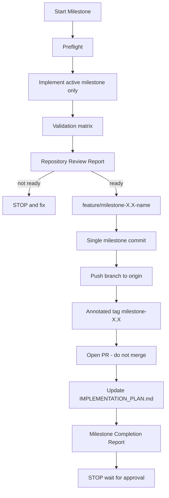

# Industrial Brain AI — Milestone-Based Git Workflow

**Document Type:** Binding Git / Release Governance Protocol  
**Product:** Industrial Brain AI  
**Status:** Active — Mandatory for every milestone  
**Created:** 2026-07-16  
**Last Updated:** 2026-07-16  

> Companion documents (do not replace this file):  
> - [ARCHITECTURE.md](ARCHITECTURE.md) — design authority  
> - [IMPLEMENTATION_PLAN.md](IMPLEMENTATION_PLAN.md) — execution & progress authority  
> - **This file** — Git branch / commit / tag / PR / release protocol  

If this workflow and the Implementation Plan conflict on *process order*, follow this file for Git/release steps and the Implementation Plan for *what* to build.

---

## 1. Binding Rules

1. **One milestone = one feature branch = one commit.** Never combine multiple milestones into one commit.  
2. **Never commit unfinished or broken work.**  
3. **Never push broken code.**  
4. **Never skip milestones.**  
5. **Never continue to the next milestone automatically.** Stop and wait for explicit user approval.  
6. **`main` must always remain stable** and independently buildable.  
7. Treat **every milestone as a production release**.  
8. Before coding, read in order: `IMPLEMENTATION_PLAN.md` → `ARCHITECTURE.md` → this file.  
9. If the working tree is **dirty** (uncommitted changes) before starting a milestone: **inform the user and stop**.  
10. Do **not** merge Pull Requests automatically.  
11. Do **not** use force-push to `main`.  
12. All Git operations for this project must use the **project-local** repository at the Industrial Brain AI workspace root — never a parent/home directory `.git`.

---

## 2. Mandatory End-of-Milestone Sequence

Every milestone must end in this exact order:

```
1. Implementation
2. Validation
3. Code Review (Repository Review Report)
4. Git Commit
5. Git Push
6. Git Tag (+ push tag)
7. Update IMPLEMENTATION_PLAN.md
8. Milestone Completion Report
9. STOP — wait for approval
```

Do **not** start the next milestone after step 9.



---

## 3. Before Implementation (Preflight)

Before starting any milestone:

| Check | Action if failed |
|---|---|
| Read `IMPLEMENTATION_PLAN.md` | Stop |
| Read `ARCHITECTURE.md` | Stop |
| Confirm current phase | Stop if unknown |
| Confirm current milestone | Stop if unknown |
| Check dependencies satisfied | Stop; report blockers |
| Verify previous milestone is Complete | Stop if incomplete |
| Working tree clean (`git status`) | Inform user; stop |
| On correct project-local repo | Fix cwd / repo; stop if ambiguous |
| `origin` remote exists (before push stage) | Inform user; create/connect remote before push |

### Preflight commands

```bash
git rev-parse --show-toplevel   # must be the Industrial Brain AI project root
git status
git branch --show-current
```

If `git status` shows uncommitted changes → **list them for the user and stop**.

---

## 4. Validation Matrix (Before Review)

Run all **applicable** checks. Do not fake green results.

### 4.1 Phase-aware applicability

| Check | Before tooling exists (e.g. Milestone 1.1) | After tooling / Docker milestones (e.g. after 1.2 / 1.9) |
|---|---|---|
| Ruff / Black / Pytest | N/A with reason if no Python package yet | **Required** |
| ESLint / Prettier / `npm run build` | N/A if no frontend package yet | **Required** |
| FastAPI boot + health | N/A if no API yet | **Required** |
| `docker compose config` + build | N/A if no Compose yet | **Required** after Milestone 1.9 |
| Hygiene + architecture gates | **Always required** | **Always required** |

Mark each N/A item as: `N/A — <reason>` in the Repository Review Report.

### 4.2 Python

```bash
ruff check .
black --check .
pytest
```

### 4.3 Frontend

```bash
npx eslint .
npx prettier --check .
npm run build
```

### 4.4 Backend

- FastAPI process boots successfully  
- Health endpoint returns success (e.g. `GET /health` → 200)

### 4.5 Docker

```bash
docker compose config
docker compose build
```

### 4.6 Hygiene (always)

Remove before review:

- Duplicate code  
- Unused imports  
- Dead code  
- Unnecessary files  
- Temporary scripts  

### 4.7 Architecture gates (always)

Verify:

- Architecture has **not** changed (unless user explicitly requested an Architecture edit)  
- No module boundary violations  
- No unnecessary files created  
- No duplicate services / models / repositories / utilities  

---

## 5. Repository Review Report (Required Before Commit)

Generate this report **after validation** and **before** creating the commit.  
If **Ready To Commit** is `No` → **STOP**. Do not commit, push, or tag.

```markdown
## Repository Review

Current Milestone: <X.X — Name>

### Files Created
- path — why it exists

### Files Modified
- path — what changed

### Files Deleted
- path — why removed

### Architecture Drift
- None | <description>

### Duplicate Code
- None | <description>

### Technical Debt
- None | <items>

### Tests
- Pass | Fail | N/A — <reason>

### Lint
- Pass | Fail | N/A — <reason>

### Formatting
- Pass | Fail | N/A — <reason>

### Build
- Pass | Fail | N/A — <reason>

### Ready To Commit
- Yes | No
```

---

## 6. Git Workflow

### 6.1 Branch naming

```
feature/milestone-<major>.<minor>-<kebab-name>
```

Examples:

- `feature/milestone-1.1-project-bootstrap`  
- `feature/milestone-1.2-backend-foundation`  
- `feature/milestone-2.1-parsing`  

### 6.2 Commit message format

```
feat(phase-<n>): complete milestone <x.x> <name>
```

Examples:

- `feat(phase-1): complete milestone 1.1 project bootstrap`  
- `feat(phase-1): complete milestone 1.2 backend foundation`  
- `feat(phase-2): complete milestone 2.1 parsing pipeline`  

### 6.3 Tag naming

```
milestone-<x.x>
```

Annotated tag message example: `Completed Milestone 1.1`

### 6.4 Exact command sequence (after review passes)

Work from the **project root**. Prefer committing from `main`’s latest stable tip via a new feature branch.

```bash
# 1) Create feature branch
git checkout main
git pull --ff-only origin main   # when origin/main exists
git checkout -b feature/milestone-X.X-name

# 2) Stage milestone changes only (avoid secrets)
git add <paths>
# or carefully: git add .   — then verify; never add .env or credentials

# 3) Show the user what will be committed — REQUIRED
git status
git diff --cached

# 4) Commit (one commit per milestone)
git commit -m "$(cat <<'EOF'
feat(phase-X): complete milestone X.X <name>

EOF
)"

# 5) Push branch
git push -u origin feature/milestone-X.X-name

# 6) Annotated tag + push tag
git tag -a milestone-X.X -m "Completed Milestone X.X"
git push origin milestone-X.X
```

**Windows PowerShell note:** If HEREDOC via `cat` is unavailable, use an equivalent non-interactive commit message form that preserves the same message text — never `-i` git commands.

### 6.5 Show files before commit

Always run `git status` and show the staged file list to the user **before** `git commit`.

### 6.6 Remote requirement

Before push:

```bash
git remote -v
```

If `origin` is missing → **inform the user**, help create/connect the GitHub remote, then continue push/tag/PR. Do not invent a push to a non-existent remote.

---

## 7. GitHub Pull Request

After pushing the branch (and tag):

1. Create a PR targeting `main` with `gh pr create`.  
2. **Do not merge** the PR.  
3. Leave merge for explicit human approval.

### 7.1 PR title

Match the milestone, e.g.:

`feat(phase-1): complete milestone 1.1 project bootstrap`

### 7.2 PR body template

```markdown
## Summary
- Completed Milestone <X.X — Name>
- Phase <N> progress update

## Changes
- <bullet list of meaningful changes>

## Testing
- Python: Ruff / Black / Pytest — Pass | Fail | N/A
- Frontend: ESLint / Prettier / build — Pass | Fail | N/A
- Backend health: Pass | Fail | N/A
- Docker: config / build — Pass | Fail | N/A

## Checklist
- [ ] Single milestone only
- [ ] Validation matrix satisfied (or N/A justified)
- [ ] Repository Review Ready To Commit = Yes
- [ ] No architecture drift
- [ ] No secrets committed
- [ ] IMPLEMENTATION_PLAN.md tracker updated

## Known Limitations
- <honest limitations for this milestone>

## Next Milestone
- <X.Y — Name> (not started; awaiting approval)
```

---

## 8. Implementation Plan Update

After successful commit, push, tag, and PR creation, update [IMPLEMENTATION_PLAN.md](IMPLEMENTATION_PLAN.md):

| Update | Required |
|---|---|
| Completed tasks for the milestone | Yes |
| Milestone status → Complete | Yes |
| Phase / overall progress % | Yes |
| Completion date | Yes |
| Notes | Yes |
| Active Execution Cursor → next milestone | Yes |
| Next Milestone field | Yes |

Do **not** redesign Architecture or invent new modules while updating the plan. Progress tracking only.

---

## 9. Milestone Completion Report (Final Response)

End every milestone implementation session with:

```markdown
## Milestone Completion Report

| Field | Value |
|---|---|
| Milestone | <X.X — Name> |
| Duration | <time or approximate> |
| Files Created | <list or count + key paths> |
| Files Modified | <list or count + key paths> |
| Files Deleted | <list or count + key paths> |
| Tests Passed | <summary> |
| Coverage | <if measured; else N/A> |
| Architecture Status | Unchanged / Aligned |
| Repository Status | Clean / <state> |
| Git Branch | feature/milestone-X.X-name |
| Commit Hash | <sha> |
| Tag | milestone-X.X |
| Pull Request Title | <title> |
| Next Milestone | <X.Y — Name> |
```

Then **STOP**. Wait for user approval before beginning the next milestone.

---

## 10. Cursor Self-Instructions (Automatic)

On every future prompt such as `Build Milestone X.X`, automatically:

1. Read `IMPLEMENTATION_PLAN.md`, `ARCHITECTURE.md`, and this workflow file.  
2. Confirm phase, milestone, dependencies, previous milestone Complete, clean tree.  
3. If dirty tree → inform user and stop.  
4. Implement **only** that milestone.  
5. Run validation matrix (applicable checks).  
6. Produce Repository Review Report; stop if not ready.  
7. Create feature branch; stage; **show files**; commit with required message format.  
8. Push branch; create annotated tag; push tag.  
9. Open PR (**do not merge**).  
10. Update `IMPLEMENTATION_PLAN.md` progress fields.  
11. Emit Milestone Completion Report.  
12. **STOP** — do not start the next milestone.

---

## 11. Forbidden Actions

| Forbidden | Why |
|---|---|
| Multiple milestones in one commit | Breaks release traceability |
| Commit on `main` for feature work | `main` must stay stable |
| Push without review pass | Prevents broken remote state |
| Auto-merge PR | Human gate required |
| Auto-start next milestone | User approval required |
| Commit `.env` / secrets / credentials | Security |
| Use parent/home `.git` | Contaminates unrelated files |
| Skip validation and mark Complete | False production readiness |
| Force-push `main` | Stability |

---

## 12. Initial Repository Bootstrap (One-Time)

Performed once for this project:

1. `git init` inside the Industrial Brain AI project root (not home directory).  
2. Root `.gitignore` for Python / Node / Docker / secrets / IDE noise.  
3. Initial `main` commit with documentation baseline so `main` starts stable.  
4. Connect GitHub `origin` before the first milestone push/PR.

Subsequent milestones follow Sections 2–9 only.

---

## 13. Quick Reference Card

| Item | Convention |
|---|---|
| Branch | `feature/milestone-1.1-project-bootstrap` |
| Commit | `feat(phase-1): complete milestone 1.1 project bootstrap` |
| Tag | `milestone-1.1` |
| PR | Open, do not merge |
| Sequence | Implement → Validate → Review → Commit → Push → Tag → Plan update → Report → STOP |

---

**Status:** This document is the binding Git governance protocol for Industrial Brain AI.  
**Next engineering step after bootstrap:** User approval → `Build Milestone 1.1`.
